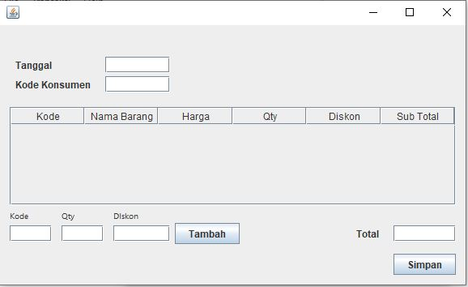

# 2023 Kelas Pemrograman Java: Catatan
## Pertemuan 6
*   Buat project baru: `TokoBuku`
*   Buat _jFrame_: `FormUtama`
    *   Buat _Menu Bar_, lakukan _Change Variabel Name_ untuk masing-masing _menu item_.     
        *   File
            *   Master
                *   Barang
        *   Exit
            *   on action perform:
                ```java
                System.exit(0);
                ```
        *   Help
            *   About
                *   on action perform:
                    ```java
                    JOptionPane.showMessageDialog(null, "Dibuat oleh En Tay");
                    ```

        

*   Program utama (_void main_), tambahkan:
    ```java
    new FormUtama().setVisible(true);
    ```

## Pertemuan 7
* Download & restore database [tokobuku.sql](https://github.com/pujangga123/ruang-belajar-java/raw/main/src/tokobuku.sql)
* Setup _Mysql Connector J_ (lihat [Java - Koneksi ke Database](https://pujangga123.github.io/ruang-belajar-java/22-koneksi-database.html))
* Menu _File - Master - Barang_: Menampilkan `FormBarang`
* Buat _jFrame_: `FormBarang`
  
    
  * imports
    ```java
    import javax.swing.table.DefaultTableModel;
    ```
  * _jTable_: `tabelBarang`
    * Kolom: _Kode (String)_, _Nama (String)_
  * _jButton_: `tombolSelesai`
    * Event on action perform:
        ```java
        setVisible(false);
        ```
  * _jButton_: `tombolReload`
    * on action perform:
        ```java
        Connection conn;
        try {
            // below two lines are used for connectivity.
            Class.forName("com.mysql.cj.jdbc.Driver");
            conn = DriverManager.getConnection("jdbc:mysql://localhost:3306/tokobuku","root","");

            Statement st;
            st = conn.createStatement();
            ResultSet rs;
            rs = st.executeQuery("select * from barang");
            
            DefaultTableModel model = (DefaultTableModel)tabelBarang.getModel();
            while(model.getRowCount()>0) { model.removeRow(0); }
            
            String kode;
            String nama;
            while (rs.next()) {
                kode = rs.getString("kode");
                nama = rs.getString("nama");
                model.addRow(new Object[]{kode, nama});
            }
            rs.close();
            st.close();
            conn.close();
        } catch (Exception exception) {
            JOptionPane.showMessageDialog(null,"Error");
        }
        ```

## Pertemuan 8
1.  Buat `FormDetailBarang`
   
    
    * imports:
     ```java
     import javax.swing.JOptionPane;
     import java.sql.*;
     ```
   * _jTextField_: `textKode`
   * _jTextFiled_: `textNama`
   * _jComboBox_: `comboJenis`
     * Property:
       * model: _ATK, Buku, Snack_
   * _jTextField_: `textHarga`
     * Property:
       * horizontalAlignment: _RIGHT_
   * Buat label untuk masing-masing objek diatas: _Kode, Nama, Jenis, Harga_
   * _jButton_: `tombolBatal`
     * Event on action perform:
        ```java
        setVisible(false);
        ```  
   * _jButton_: `tombolTambah`
     * Event on action perform:
        ```java
        Connection conn;
        try {
            // below two lines are used for connectivity.
            Class.forName("com.mysql.cj.jdbc.Driver");
            conn = DriverManager.getConnection("jdbc:mysql://localhost:3306/tokobuku","root", "");
            
            // baca data
            String kode = textKode.getText();
            String nama = textNama.getText();
            String jenis = comboJenis.getSelectedItem().toString();
            int harga = Integer.parseInt(textHarga.getText());
            
            // SQL
            String sql = "insert into barang (kode, nama, jenis, harga) values (?,?,?,?)";
            
            // siapkan statement untuk INSERT
            PreparedStatement pst = conn.prepareStatement(sql);
            pst.setString(1, kode);
            pst.setString(2, nama);
            pst.setString(3, jenis);
            pst.setInt(4, harga);
            
            // eksekusi SQL
            pst.execute(); 
            
            // hapus objek 
            pst.close();
            conn.close();
            
            // tampilkan pesan
            JOptionPane.showMessageDialog(null, "Data berhasil disimpan");
        } catch(Exception e) {
            JOptionPane.showMessageDialog(null,e.getMessage().toString());
        } 
        ```
2. Edit `FormBarang`
   * on window opened:
        ```java
        tombolReload.doClick();
        ```
   * _jButton_: `tombolTambah`
     * Event on action perform:
        ```java
        FormDetailBarang f = new FormDetailBarang();
        f.setVisible(true);
        ```
   * _jTable_: `tabelBarang`
     * Event on _mouseClicked_:
       ```java
       // membaca nomor baris yang diklik
       Point p = evt.getPoint();
       int row = tabelBarang.rowAtPoint(p);
        
       // ambil kode barang dari baris yang di klik
       String kode = tabelBarang.getModel().getValueAt(row, 0).toString();
        
       // tampilkan kode
       JOptionPane.showMessageDialog(null, kode);
       ```

## Pertemuan 9
1.  Buat file class _Global_ (ganti kata _Global_ jadi _nama Anda_), kode:
    ```java
    package TokoBuku;

    import java.sql.Connection;
    import java.sql.DriverManager;

    public class Global { // Ganti 'Global' jadi nama Anda
        public static final String NAMA = "En Tay";  // ganti jadi nama Anda
        public static final String DBDRIVER = "com.mysql.cj.jdbc.Driver";
        public static final String DBCONNECTION = "jdbc:mysql://localhost:3306/tokobuku"; // sesuaikan
        public static final String DBUSER = "root"; // sesuaikan
        public static final String DBPASS = ""; // sesuaikan
        
        // fungsi untuk menyederhanakan perintah untuk koneksi ke database.
        // perintah:
        //      Connection conn;
        //      Class.forName(DBDRIVER);
        //      conn = DriverManager.getConnection(DBCONNECTION,DBUSER,DBPASS);
        // menjadi:
        //      Connection conn;
        //      conn = Global.db();
        public static Connection db() {
            try {
                Class.forName(DBDRIVER);
                return DriverManager.getConnection(DBCONNECTION,DBUSER,DBPASS);
            }catch(Exception e) {
                return null;
            }
        }

    }

    ```
4.  Edit `FormDetailBarang`
    *   buat _jButton_: `tombolUpdate`
        *   event on _action perform_:
            ```java
            Connection conn;
            try {                
                // pada bagian ini kita menggunakan Global.db(), untuk menggantikan perintah:
                // Class.forName dan DriverManager.getConnection
                conn = Global.db();  // ingat, ganti kata Global dengan nama Anda.
                
                // baca data
                String kode = textKode.getText();
                String nama = textNama.getText();
                String jenis = comboJenis.getSelectedItem().toString();
                int harga = Integer.parseInt(textHarga.getText());
                
                // SQL
                String sql = "update barang set nama=?, jenis=?, harga=? where kode=?";
                
                // siapkan statement untuk INSERT
                PreparedStatement pst = conn.prepareStatement(sql);
                pst.setString(1, nama);
                pst.setString(2, jenis);
                pst.setInt(3, harga);
                pst.setString(4, kode);
                
                // eksekusi SQL
                pst.execute(); 
                
                // hapus objek 
                pst.close();
                conn.close();
                
                // tampilkan pesan
                JOptionPane.showMessageDialog(null, "Data berhasil disimpan");
            } catch(Exception e) {
                JOptionPane.showMessageDialog(null,e.getMessage().toString());
            } 
            ```
    *   Tambahkan fungsi ke source `FormDetailBarang`
        ```java
        public void baca(String kode) {
            tombolUpdate.setVisible(true);
            tombolTambah.setVisible(false);
            Connection conn;
            try {
                Class.forName("com.mysql.cj.jdbc.Driver");
                conn = DriverManager.getConnection("jdbc:mysql://localhost:3306/tokobuku","root", "");

                Statement st;
                st = conn.createStatement();
                ResultSet rs;
                rs = st.executeQuery("select * from barang where kode='"+kode+"'");

                if(rs.next()) {
                    textKode.setText(rs.getString("kode"));
                    textNama.setText(rs.getString("nama"));
                }
                st.close();
                rs.close();
                conn.close();
            } catch(Exception e) {
                JOptionPane.showMessageDialog(null,"gagal baca");
            } 
            setVisible(true);
        }    

        public void baru() {
            textKode.setText("");
            textNama.setText("");
            comboJenis.setSelectedIndex(0);
            textHarga.setText("0");
            setVisible(true);
            
            tombolUpdate.setVisible(false);
            tombolTambah.setVisible(true);
        }    
        ```
    
5.  Edit `FormBarang`
    *   _jTable_: `tabelBarang`
        *   Edit event on _mouseClicked_:
            ```java
            // membaca nomor baris yang diklik
            Point p = evt.getPoint();
            int row = tabelBarang.rowAtPoint(p);
                
            // ambil kode barang dari baris yang di klik
            String kode = tabelBarang.getModel().getValueAt(row, 0).toString();
                
            // panggil fungsi kode di FormDetailBarang
            FormDetailBarang f = new FormDetailBarang();
            f.baca(kode);
            ```
        *   _jButton_: `tombolTambah`
            *   Edit event on _action perform_:
                ```java
                FormDetailBarang f = new FormBarangDetail();
                f.baru();
                ```

## Pertemuan 10
1.  Tambahkan _jMenu_:`menuTransaksi`
2.  _jMenuItem_:`menuTransaksiInput`
   *    on action perform:
        ```java
        new FormTransaksi().setVisible(true);
        ```

        

3.  Buat _jFrame_: `FormTransaksi`
    
    
    
    | komponen / label | class | variable name |
    | --- | --- | --- | 
    | Tanggal | jTextField | textTanggal |
    | Kode Konsumen | jTextField | textKodeKonsumen |
    | Tabel Detail | jTable | tabelDetail |
    | Kode | jTextField | textKode |
    | Qty | jTextField | textQty |
    | Diskon | jTextField | textDiskon |
    | Tambah | jButton | tombolTambah |
    | Total | jTextField | textTotal |
    | Simpan | jButton | tombolSimpan |

    *   edit _Table Contents_ untuk `tabelDetail`, set _Title_ dan _Type_ untuk masing-masing kolom.

        

        Pada tab _Rows_, set Count menjadi `0`

        

    *   siapkan _import_ yang diperlukan
        ```java
        import java.sql.*;
        import javax.swing.JOptionPane;
        import javax.swing.table.DefaultTableModel;
        ```
        
4.  tambahkan fungsi `totalHitung()` di `FormTransaksi`
    ```java
    public void totalHitung() {
        
        int total = 0;
        for(int n=0; n<tabelDetail.getModel().getRowCount(); n++) {
            total += (int)tabelDetail.getModel().getValueAt(n,5);
        }
        textTotal.setText(Integer.toString(total));
    }
    ```
    cara menambahkan fungsi ini sama dengan cara menambahkan fungsi `baca()` pada `FormDetailBarang`

5.  edit `tombolTambah` di `FormTransaksi`
    *   on action perform
        ```java
        DefaultTableModel model = (DefaultTableModel)tabelDetail.getModel();
        Connection conn;
        
        try {
            String kode = textKodeBarang.getText();

            conn = Global.db();   // ganti "Global" sesuai dengan nama Anda, (class sesuai nama Anda)
                                  // lihat Pertemuan 9 poin 1
            PreparedStatement pst = conn.prepareStatement("select * from barang where kode=?");
            pst.setString(1, kode);
            
            ResultSet rs;
            rs = pst.executeQuery();  
            
            if(rs.next()) {
                String nama = rs.getString("nama");
                int harga = rs.getInt("harga");
                int qty = Integer.valueOf(textQty.getText());
                int diskon = Integer.valueOf(textDiskon.getText());
                int subtotal = (harga * qty) - diskon;
                model.addRow(new Object[]{kode, nama, harga, qty, diskon, subtotal });
                totalHitung();
            }
        
        } catch (Exception e) {
            JOptionPane.showMessageDialog(null,e.getMessage().toString()); // opsionals
        }
        ```

## Pertemuan 11
1.  Pada `FormTransaksi`, edit `tombolSimpan`
    *   on action perform:
        ```java
        Connection conn;
        try {
            conn = Global.db();  // ganti "Global" sesuai dengan nama Anda, (class sesuai nama Anda)
                                 // lihat Pertemuan 9 poin 1
            
            String tanggal = textTanggal.getText(); // tanggal hanya ditulis dalam format yyyy-mm-dd
            String konsumenId = textKodeKonsumen.getText();
                                   
            // SQL untuk input ke tabel jualmaster
            String sql = "insert into jualmaster (tanggal, konsumenId) values (?,?)";
            
            // siapkan statement untuk INSERT
            PreparedStatement pst = conn.prepareStatement(sql,  Statement.RETURN_GENERATED_KEYS);
            pst.setString(1, tanggal);
            pst.setString(2, konsumenId);
            
            // baca ID AUTO INCREMENT yang terakhir dibuat
            pst.execute(); 
            ResultSet rs = pst.getGeneratedKeys();
            rs.next();
            int id = rs.getInt(1);
            
            sql = "insert into jualdetail (jualNomor, barangKode, qty, harga, diskon) values (?,?,?,?,?)";
            pst = conn.prepareStatement(sql);
            int row=0;
            while(row<tabelDetail.getModel().getRowCount()){
                String kode = tabelDetail.getModel().getValueAt(row, 0).toString();
                int harga = (int)tabelDetail.getModel().getValueAt(row, 2);
                int qty = (int)tabelDetail.getModel().getValueAt(row, 3);
                int diskon = (int)tabelDetail.getModel().getValueAt(row, 4);
                
                pst.setInt(1,id);
                pst.setString(2, kode);
                pst.setInt(3, qty);
                pst.setInt(4, harga);
                pst.setInt(5,diskon);
                pst.execute();
                row++;
            }
            
            // hapus objek 
            pst.close();
            conn.close();
            
            // tampilkan pesan
            JOptionPane.showMessageDialog(null, "Data berhasil disimpan");
        } catch(Exception e) {
            //JOptionPane.showMessageDialog(null,e.getMessage().toString());
            JOptionPane.showMessageDialog(null,e.getMessage().toString());
        }
        ```
2.  Tambahkan beberapa fitur berikut pada `FormTransaksi`
    *   Setelah klik memasukan data ke `tabelDetail` lewat `tombolTambah`, kosongkan _kode barang, qty dan diskon_.
    *   Buat tampilan angka pada _textTotal_ rata kanan.
    *   Tambahkan validasi pada `tombolTambah` _on action perform_: Jika _kode, qty_ atau _diskon_ kosong, maka hentikan proses, tampilkan pesan: _Kode, Qty dan Diskon harus diisi_.