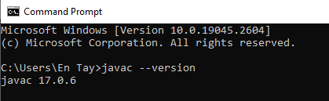

# Instalasi dan Setup

## Download
### JDK
- https://www.oracle.com/id/java/technologies/downloads/

### IDE

**Netbean**
_Netbean_ adalah IDE yang cukup populer digunakan untuk pemrograman _Java_.
- https://netbeans.apache.org/download/index.html

**Eclipse**
_Eclipse_ adalah IDE alternatif digunakan untuk pemrograman _Java_.
- https://www.eclipse.org/downloads/packages/release/kepler/sr1/eclipse-ide-java-developers

**Notepad++**
_Notepad++_ adalah editor sederhana yang biasa digunakan untuk program-program Java yang relatif sederhana.
- https://notepad-plus-plus.org/downloads/


## Online
- https://www.programiz.com/java-programming/online-compiler/
- https://www.online-java.com/
- https://www.tutorialspoint.com/online_java_compiler.php

## Menjalankan Program Java Pertama Anda

Kita akan coba membuat dan menjalankan program _Java_ pertama kita. Untuk itu, buat program berikut, simpan dengan nama file `HelloWorld.java`. Untuk program sederhana, disarankan menggunakan editor _Notepad++_.

```java
class HelloWorld {
    public static void main(String[] args) {
        System.out.println("Hello, World!"); 
    }
}
```

Program _Java_ ini akan dijalankan lewat _command prompt_. Dengan demikian buka _command prompt_ dan pastikan komputer Anda sudah bisa menjalankan program java, gunakan perintah `javac --version`. Versi _Java_ akan muncul sebagai output jika _Java Runtime_ sudah terpasang dengan benar pada komputer Anda.



Berikutnya, set folder aktif, ke lokasi folder dimana file `HelloWorld.java` disimpan (contoh: `C:\latihan`).
Sebelum program ini bisa dijakankan, ia perlu di-_compile_ terlebih dahulu. Untuk melakukan _compile_ gunakan perintah `javac HelloWorld.java`. Perintah ini akan menghasilkan file _byte code_ `HelloWorld.class`, dan untuk menjalankan file program hasil _compile_, gunakan perintah `java HelloWorld`.

```
C:\latihan>javac HelloWorld.java

C:\latihan>java HelloWorld
Hello, World!

```

## Menjalankan _Java Project_

Beberapa project Java yang dibuat menggunakan editor seperti (misalnya) _Netbean_ atau _Eclipse_ menggunakan folder untuk mengelompokan file-filenya. Tentu project ini lebih mudah untuk dijalankan menggunakan IDE sesuai yang digunakan oleh programmer, tapi ada kalanya kita juga perlu melakukan kompilasi lewat CLI.

Sebagai contoh, download dan extract project berikut: https://github.com/hexadeciman/Snake/archive/refs/heads/master.zip

Setelah Anda extract file tersebut, Anda akan mendapati bahwa file _.java_ pada project tersebut terdiri lebih dari berapa file dan disimpan dalam folder _src_, dan bagian program utamanya (file yang menyimpan `void main`), adalah `Main.java`.

```
DataOfSquare.java
KeyboardListener.java
Main.java
SquarePanel.java
ThreadsController.java
Tuple.java
Window.java
```

Dengan demikian untuk menjalankan program tersebut, langkap pertama: Compile semua file _.java_ dan menyimpan hasil _compile_ nya ke folder terpisah. Untuk melakukan ini, pastikan pada CLI/CMD, pastikan posisi folder aktif berada pada folder _Snake_. Eksekusi perintah berikut:

```
C:\latihan\Snake> javac -sourcepath src -d out src/Main.java
```

**Penjelasan:**
* `src` pada `-sourcepath src` menunjuk pada lokasi file _.java_ disimpan
* `out` pada `-d out` menunjuk pada lokasi folder dimana file hasil kompilasi (file _.class) akan disimpan. Setelah proses kompilasi selesai, maka folder `out` akan berikut file _.class_ hasil kompilasi.
* `src/Main.java` menunjuk pada file program utama pada project.

Setelah proses kompilasi selesai, untuk mengeksekusi program, gunakan perintah berikut:

```
C:\latihan\Snake> java -classpath out Main
```

Referensi:
* https://www.baeldung.com/javac-compile-classes-directory