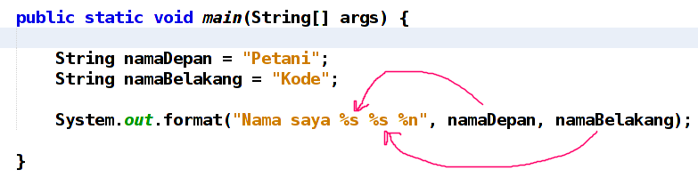

# Standard Input & Output

Seperti yang kita ketahui, program komputer terdiri dari tiga komponen utama, yaitu: input, proses, dan output.

Input: nilai yang kita masukan ke program
Proses: langkah demi langkah yang dilakukan untuk mengelola input menjadi sesuatu yang berguna
Output: hasil pengolahan
Semua bahasa pemrograman telah menyediakan fungs-fungsi untuk melakukan input dan output.

Java sendiri sudah menyediakan tiga class untuk mengambil input:
1. Class Scanner;
2. Class BufferReader;
3. Class Console.
 
Tiga class tersebut untuk mengambil input pada program berbasis teks (console). Sedangkan untuk GUI menggunakan class yang lain seperti JOptionPane dan inputbox pada form.

Sementara untuk outputnya, Java menyediakan fungsi `print()`, `println()`, dan `format()`.

## Mengambil Input
### 1. Class Scanner
Scanner merupakan class yang menyediakan fungsi-fungsi untuk mengambil input dari keyboard.

Agar kita bisa menggunakan Scanner, kita perlu mengimpornya ke dalam kode:

```java
import java.util.Scanner;
```

Cobalah siapkan program berikut:

```java
// mengimpor Scanner ke program
import java.util.Scanner;

public class DataKaryawan {

    public static void main(String[] args) {
        // deklarasi variabel
        String nama, alamat;
        int usia, gaji;

        // membuat scanner baru
        Scanner keyboard = new Scanner(System.in);

        // Tampilkan output ke user
        System.out.println("### Pendataan Karyawan PT. ABC ###");
        System.out.print("Nama karyawan: ");
        // menggunakan scanner dan menyimpan apa yang diketik di variabel nama
        nama = keyboard.nextLine();
        // Tampilkan outpu lagi
        System.out.print("Alamat: ");
        // menggunakan scanner lagi
        alamat = keyboard.nextLine();

        System.out.print("Usia: ");
        usia = keyboard.nextInt();

        System.out.print("Gaji: ");
        gaji = keyboard.nextInt();


        // Menampilkan apa yang sudah simpan di variabel
        System.out.println("--------------------");
        System.out.println("Nama Karyawan: " + nama);
        System.out.println("Alamat: " + alamat);
        System.out.println("Usia: " + usia + " tahun");
        System.out.println("Gaji: Rp " + gaji);
    }

}
```

Perlu diperhatikan, penggunakan fungsi untuk mengambil data bergantung dari tipe data yang digunakan.

Misal, tipe datanya adalah _String_, maka fungsi atau method yang dipakai adalah `nextLine()`.

Begitu juga dengan tipe data lain, Integer menggunakan `nextInt()`, Double menggunakan n`extDouble()`, dsb.

### 2. Class BufferReader

Class `BufferReader` sebenarnya tidak hanya untuk mengambil input dari keyboard saja.

Class ini juga dapat digunakan untuk membaca input dari file dan jaringan.

Class ini terletak di dalam paket `java.io`.

Silahkan diimpor untuk dapat menggunakan class `BufferReader`.
```java
import java.io.BufferedReader;
```

Cobalah siapkan program berikut:

```java

import java.io.BufferedReader;
import java.io.IOException;
import java.io.InputStreamReader;

public class ContohBufferReader {

    public static void main(String[] args) throws IOException {

        String nama;

        // Membuat objek inputstream
        InputStreamReader isr = new InputStreamReader(System.in);

        // membuat objek bufferreader
        BufferedReader br = new BufferedReader(isr);

        // Mengisi varibel nama dengan Bufferreader
        System.out.print("Inputkan nama: ");
        nama = br.readLine();

        // tampilkan output isi variabel nama
        System.out.println("Nama kamu adalah " + nama);
    }
}
```
Ternyata class `BufferReader` tidak bisa bekerja sendirian. Dia juga butuh teman yaitu: class `InputStreamReader` dan class `IOException`.

Sekarang mari kita coba jalankan programnya:

```
Inputkan nama: Budi Raharjo
Nama kamu adalah Budi Raharjo
```
### 3. Class Console

Class `Console` hampir sama dengan `BufferReader`. Dia juga menggunakan fungsi `readLine()` untuk mengambil input. Hanya saja, class ini hanya bisa digunakan di lingkungan console saja, seperti Terminal dan CMD.

Class Console tidak bisa digunakan langsung di Netbeans.

Maka dari itu, kita harus kompilasi secara manual.

Untuk menggunakan class ini, kita perlu mengimpornya terlebih dahulu.
```java
import java.io.Console;
```

Cobalah siapkan program berikut:

```java
import java.io.Console;

public class InputConsole {
    public static void main(String[] args) {

        String nama;
        int usia;

        // membuat objek console
        Console con = System.console();

        // mengisi variabel nama dan usia dengan console
        System.out.print("Inputkan nama: ");
        nama = con.readLine();
        System.out.print("Inputkan usia: ");
        usia = Integer.parseInt(con.readLine());

        // mengampilkan isi variabel nama dan usia
        System.out.println("Nama kamu adalah: " + nama);
        System.out.println("Saat ini berusia " + usia + " tahun");
    }
}
```

Output:
```
Inputkan nama: Budi Raharjo
Inputkan usia: 22
Naa kamu adalah: Budi Raharjo
Saat ini berusia 22 tahun
```

**Perhatikan:** dalam kode di atas, kita menggunakan fungsi `Integer.parseInt(con.readLine())` untuk tipe data integer. Artinya, kita merubah tipe data String ke Integer. Karena `Console` tidak memiliki nilai kembalian berupa integer untuk fungsi `read()`.


## Menampilkan Output

Kita sudah mengenal beberapa cara mengambil input dari keyboard untuk program berbasis teks.

Sekarang bagaimana dengan outputnya?

Ada beberapa fungsi yang sudah disediakan oleh Java:
1. Fungsi `System.out.print()`
2. Fungsi `System.out.println()`
3. Fungsi `System.out.format()`

Apa saja perbedaan dari fungsi-fungsi tersebut?

### Fungsi print() vs println()
Fungsi `print()` dan `println()` sama-sama digunakan untuk menampilkan teks. Perbedaannya adalah fungsi `print()` akan menampilkan teks apa adanya. Sedangkan `println()` akan menampilkan teks dengan ditambah baris baru.

Mari kita coba dalam kode:

```java
public class PrintVsPrinln {

    public static void main(String[] args) {

        System.out.print("ini teks yang dicetak dengan print()");
        System.out.println("sedangkan ini teks yang dicetak dengan println()");
        System.out.print("pake print() lagi");

    }

}
```
Sekarang lihat hasil outputnya:
```
ini teks yang dicetak dengan print()sedangkan ini teks yang dicetak dengan println()
pake print() lagi

```

## Menggabungkan String
Ketika menggunakan fungsi `print()` maupun `println()`, kadang kita perlu mengambil teks dari variabel dan menggabungkannya dengan teks yang lain.

Misalnya seperti ini:

Kita punya variabel namaDepan dan namaBelakang:
```java
String namaDepan = "Budi";
String namaBelakang = "Raharjo";
```
Kemudian kita ingin menampilkannya dengan fungsi print(), maka kita hanya perlu memasukkannya ke sana.

```java
System.out.print(namaDepan);
System.out.print(namaBelakang);
```
Kode tersebut akan menghasilkan: BudiRaharjo

Sebenarnya kita tidak perlu menggunakan dua fungsi print(), karena kita bisa menggabungkannya dengan operator +.

Contoh:
```java
System.out.print(namaDepan + namaBelakang);
```
Agar ada spasi, tinggal ditambahkan saja spasi:
```java
System.out.print(namaDepan + " " + namaBelakang);
```

## Format String
Sedangkan untuk menggabungkan String yang lebih kompleks, kita bisa menggunakan fungsi format().

Contoh:
```java
public class FormatString {

    public static void main(String[] args) {

        String namaDepan = "Budi";
        String namaBelakang = "Raharjo";

        System.out.format("Nama saya %s %s %n", namaDepan, namaBelakang);

    }

}
```
Perhatikan: di sana kita menggunakan simbol %s untuk mengambil nilai dari variabel di sampingnya. %s artinya string.

Selain %s, ada juga simbol lain:

%d untuk desimal atau angka;
%f untuk bilangan pecahan;
%n untuk baris baru, bisa juga pakai \n;
dan masih banyak lagi, [cek di dokumentasi java](https://docs.oracle.com/javase/tutorial/java/data/numberformat.html).



Kode di atas akan menghasilkan: `Nama saya Budi Raharjo`

---
**Referensi:**
- [https://www.petanikode.com/java-input-output/](https://www.petanikode.com/java-input-output/)