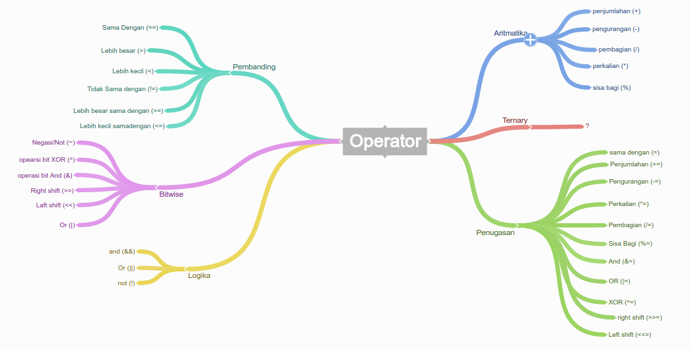
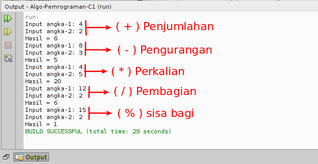
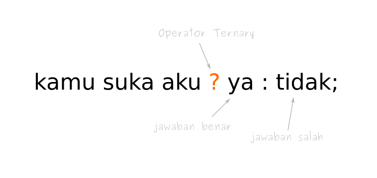

# Operator

Operator dalam pemrograman digunakan untuk melakukan operasi tertentu.

Misalkan kita ingin menjumlahkan nilai dari variabel `x` dan `y`, maka kita bisa menggunakan operator penjumlahan (`+`).

```java
x + y
```

Ada enam jenis kelompok operator dalam pemrograman Java:

1. Operator Artimatika;
2. Operator Penugasan;
3. Operator Pembanding;
4. Operator Logika;
5. Operator Bitwise;
6. Operator Ternary.
   
Bila digambarkan dalam mind map, akan terlihat seperti ini:




## 1. Operator Aritmatika
Operator aritmatika digunakan untuk melakukan operasi aritmatika.

Operator ini terdiri dari:

| Nama | Simbol |
| --- | --- |
| Penjumlahan | + |
| Pengurangan | - |
| Perkalian | * |
| Pembagian | / |
| Sisa Bagi | % |

Contoh pemakaian:

```java
import java.util.Scanner;

public class OperatorAritmatika {

    public static void main(String[] args) {
        int angka1;
        int angka2;
        int hasil;

        Scanner keyboard = new Scanner(System.in);

        System.out.print("Input angka-1: ");
        angka1 = keyboard.nextInt();
        System.out.print("Input angka-2: ");
        angka2 = keyboard.nextInt();

        // penjumlahan
        hasil = angka1 + angka2;
        System.out.println("Hasil = " + hasil);

        System.out.print("Input angka-1: ");
        angka1 = keyboard.nextInt();
        System.out.print("Input angka-2: ");
        angka2 = keyboard.nextInt();

        // pengurangan
        hasil = angka1 - angka2;
        System.out.println("Hasil = " + hasil);

         System.out.print("Input angka-1: ");
        angka1 = keyboard.nextInt();
        System.out.print("Input angka-2: ");
        angka2 = keyboard.nextInt();

        // perkalian
        hasil = angka1 * angka2;
        System.out.println("Hasil = " + hasil);


        System.out.print("Input angka-1: ");
        angka1 = keyboard.nextInt();
        System.out.print("Input angka-2: ");
        angka2 = keyboard.nextInt();

        // Pembagian
        hasil = angka1 / angka2;
        System.out.println("Hasil = " + hasil);

        System.out.print("Input angka-1: ");
        angka1 = keyboard.nextInt();
        System.out.print("Input angka-2: ");
        angka2 = keyboard.nextInt();

        // Sisa Bagi
        hasil = angka1 % angka2;
        System.out.println("Hasil = " + hasil);

    }

}
```

Output program:



Mari kita coba contoh kasus lain: _Program menghitung keliling persegi panjang_.

```java
public class KelilingPersegiPanjang {
    public static void main(String[] args) {
        //deklarasi
        double keliling, p, l;

        //input
        p = 6.0;
        l = 3.0;

        //proses
        keliling = (2*p) + (2*l);

        //output
        System.out.println(keliling);
    }
}
```

## 2. Operator Penugasan
Operator penugasan (Assignment Operator) fungsinya untuk memberikan tugas pada variabel tertentu. Biasanya untuk mengisi nilai.

Contoh:
```java
int a = 10;
```

Variabel a ditugaskan untuk menyimpan nilai 10.

Operator Penugasan terdiri dari:

| Nama Operator | Symbol |
| --- | --- |
| Pengisian Nilai   | `=` |
| Pengisian dan Penambahan  | `+=` |
| Pengisian dan Pengurangan	| `-=` |
| Pengisian dan Perkalian	| `*=` |
| Pengisian dan Pembagian	| `/=` |
| Pengisian dan Sisa bagi	| `%=` |

Pelajari penggunaan operator penugasan pada contoh program berikut.

```java
public class OperatorPenugasan {

    public static void main(String[] args) {
        int a;
        int b;

        // Pengisian nilai
        a = 5;
        b = 10;

        // penambahan
        b += a;
        // sekarang b = 15
        System.out.println("Penambahan : " + b);

        // pengurangan
        b -= a;
        // sekarang b = 10 (karena 15-5)
        System.out.println("Pengurangan : " + b);

        // perkalian
        b *= a;
        // sekarang b = 50 (karena 10*5)
        System.out.println("Perkalian : " + b);

        // Pembagian
        b /= a;
        // sekarang b=10
        System.out.println("Pembagian : " + b);

        // Sisa bagi
        b %= a;
        // sekarang b=0
        System.out.println("Sisa Bagi : " + b);

    }

}
```

Hasil outputnya:

```
Penambahan : 15
Pengurangan : 10
Perkalian : 50
Pembagian : 10
Sisa Bagi : 0
```

## 3. Operator Pembanding
Seperti namanya, tugas operator ini untuk membandingkan. Operator ini juga dikenal dengan _operator relasi_. Nilai yang dihasilkan dari operator ini berupa boolean, yaitu: `true` dan `false`.

Operator ini terdiri dari:

| Nama	| Simbol |
| --- | --- |
| Lebih Besar | `>` |
| Lebih Kecil | `<` |
| Sama Dengan | `==` |
| Tidak Sama dengan	| `!=` |
| Lebih Besar Sama dengan	| `>=` |
| Lebih Kecil Sama dengan	| `<=` |

contoh:

```java
boolean x = 10 < 12
```

Maka `x` akan bernilai `true`, karena `10` lebih kecil dari `12`.

Untuk lebih jelasnya…

Mari kita coba dalam kode
Buatlah sebuah kelas baru bernama OperatorPembanding. Kemudian ikuti kode berikut:
```java
public class OperatorPembanding {

    public static void main(String[] args) {
        int nilaiA = 12;
        int nilaiB = 4;
        boolean hasil;

        // apakah A lebih besar dari B?
        hasil = nilaiA > nilaiB;
        System.out.println(hasil);

        // apakah A lebih kecil dari B?
        hasil = nilaiA < nilaiB;
        System.out.println(hasil);

        // apakah A lebih besar samadengan B?
        hasil = nilaiA >= nilaiB;
        System.out.println(hasil);

        // apakah A lebih kecil samadengan B?
        hasil = nilaiA <= nilaiB;
        System.out.println(hasil);

        // apakah nilai A sama dengan B?
        hasil = nilaiA == nilaiB;
        System.out.println(hasil);

        // apakah nilai A tidak samadengan B?
        hasil = nilaiA != nilaiB;
        System.out.println(hasil);

    }

}
```

output:
```
false
true
false
false
true
```

## 4. Operator Logika
Kalau kamu pernah belajar logika matematika, pasti tidak akan asing dengan operator ini.

| Nama |	Simbol di Java |
| --- | --- |
| Logika AND	| `&&` |
| Logika OR	    | `\|\|` |
| Negasi/kebalikan	| `!` |

Operator Logika digunakan untuk membuat operasi logika.

Misalnya seperti ini:

* `Pernyataan 1`: _Budi seorang programmer_
* `Pernyattan 2`: _Budi menggunakan Linux_
Jika ditanya, _apakah Budi programmer yang menggunakan Linux_?

Tentu kita akan cek dulu kebenarannya

* `Pernyataan 1`: _Budi seorang programmer_ = `true`.
* `Pernyattan 2`: _Budi menggunakan Linux_ = `true`.
  
Apa _Budi programmer_ **dan** _menggunakan Linux_?

`Pernyataan 1` **&&** `Pernyataan 2` = `true`

Coba cek lagi tabel kebenaran untuk logika AND.

| Pernyatan 1 |	Pernyataan 2 | Logika AND |
| --- | --- | --- |
| `true` | `true` | `true` |
| `true` | `false` | `false` |
| `false` | `true` | `false` |
| `false` | `false` | `false` |

Coba pelajari program berikut:

```java
public class OperatorLogika {
    public static void main(String[] args) {
        boolean a = true;
        boolean b = false;
        boolean c;

        // AND
        c = a && b;
        System.out.println("true && false = "+c);

        // OR
        c = a || c;
        System.out.println("true || false = "+c);
        
        // NOT
        System.out.println("NOT, !true"+!a);
        
    }
}
```

output:
```
true && false = false
true && false = true
NOT, !true = false
```

## 5. Operator Bitwise

Operator bitwise merupkan operator yang digunakan untuk operasi bit (biner). Operator bitwise terdiri dari:

| Nama | 	Simbol di Java |
| --- | --- |
| AND	| `&` |
| OR	| `\|` |
| XOR	| `^` |
| Negasi/kebalikan |	`~` |
| Left Shift  |	`<<` |
| Right Shift |	`>>` |
| Left Shift (unsigned) |	`<<<` |
| Right Shift (unsigned) |	`>>>` |

Operator ini berlaku untuk tipe data `int`, `long`, `short`, `char`, dan `byte`.

Operator ini akan menghitung dari bit-ke-bit.

Misalnya, kita punya variabel `a = 60` dan `b = 13`.

Bila dibuat dalam bentuk biner, akan menjadi seperti ini:

```
a = 00111100
b = 00001101
```

Jika digambarkan, operasi bitwise adalah sebagai berikut:

Operasi AND
```
a = 00111100
b = 00001101
a & b = 00001100
```

Operasi OR
```
a = 00111100
b = 00001101
a | b = 00111101
```

Operasi XOR
```
a = 00111100
b = 00001101
a ^ b = 00110001
```

Opearsi NOT (Negasi/kebalikan)
```
a = 00111100
~a  = 11000011
```

Konsepnya memang hampir sama dengan opeartor Logika. Bedanya, Bitwise digunakan untuk biner.

Untuk lebih jelasny pelajari program berikut:

```java
public class OperatorBitwise {

    public static void main(String[] args) {
        int a = 60;    /* 60 = 0011 1100 */
        int b = 13;    /* 13 = 0000 1101 */
        int c = 0;

        c = a & b;       /* 12 = 0000 1100 */
        System.out.println("a & b = " + c);

        c = a | b;       /* 61 = 0011 1101 */
        System.out.println("a | b = " + c);

        c = a ^ b;       /* 49 = 0011 0001 */
        System.out.println("a ^ b = " + c);

        c = ~a;          /*-61 = 1100 0011 */
        System.out.println("~a = " + c);

        c = a << 2;     /* 240 = 1111 0000 */
        System.out.println("a << 2 = " + c);

        c = a >> 2;     /* 215 = 1111 */
        System.out.println("a >> 2  = " + c);

        c = a >>> 2;     /* 215 = 0000 1111 */
        System.out.println("a >>> 2 = " + c);
    }

}
```
Perhatikanlah hasil outputnya:
```
a & b = 112
a | b = 1
a & b = 49
~a = -61
a << 2 240
a >> 2 = 15
a >>> 2 = 15
```


## . Operator Ternary

Opertor ini unik, seperti membuat pertanyaan.

Simbolnya menggunakan tanda tanya (`?`) dan titik-dua (`:`) untuk memisah jawabannya.




Pada contoh di atas, "Kamu suka aku" adalah pertanyaan atau kondisi yang akan diperiksa.

Kalau jawabannya benar, maka _ya_. Sebaliknya akan _tidak_.

Lebih jelasnya, pelajari program berikut:

```java
public class OperatorTernary {
    public static void main(String[] args) {

        boolean suka = true;
        String jawaban;

        // menggunakan operator ternary
        jawaban = suka ? "iya" : "tidak";

        // menampilkan jawaban
        System.out.println(jawaban);

    }
}
```
Hasil outputnya:
```
iya
```

Sekarang coba ganti nilai variabel `suka` menjadi `false`, lalu dijalankan lagi.

Pasti akan menghasilkan `tidak`.

Cara lain, dapat juga membuat kondisi seperti ini:

```java
int suka = 8;

String jawaban = (suka > 5) ? "iya" : "tidak";
```

---
**Referensi:**
- [https://www.petanikode.com/java-operator/](https://www.petanikode.com/java-operator/)