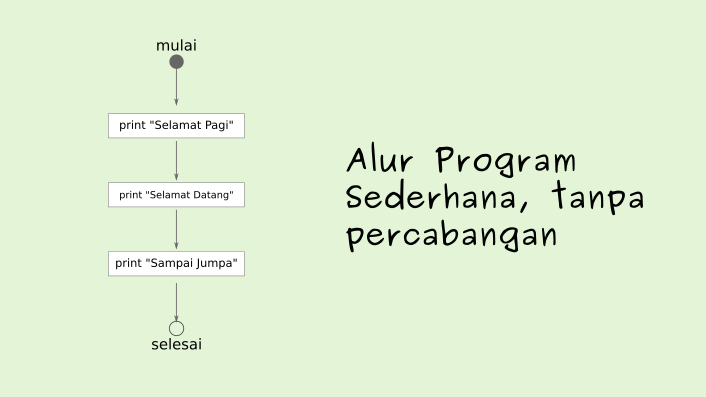
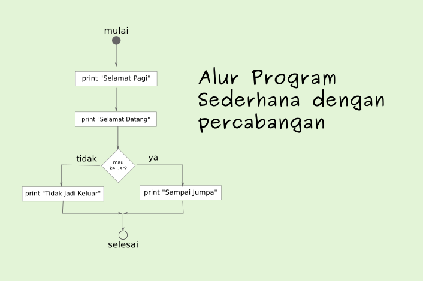
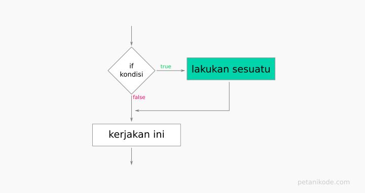
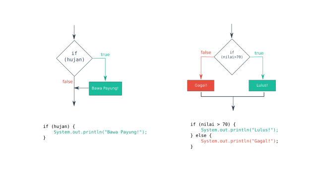
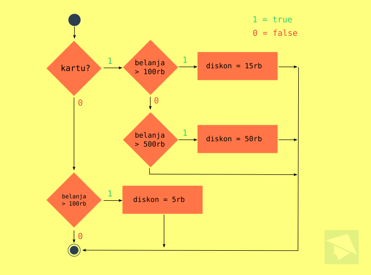

# Pengambilan Keputusan

Komputer akan menjalankan/eksekusi instruksi program yang kita buat secara berurut.

Misalnya seperti ini:



Kepada komputer kita juga bisa memberikan instruksi kepada komputer untuk mengambil keputusan berdasarkan suatu kondisi. Jika digambarkan dalam bentuk flowchart, pengambilan keputusan ini akan membuat percabangan. Untuk _pengambilan keputusan_ ini, kadang juga digunakan istilah _Control Flow_, _Percabangan_, _IF_, atau _decision_. Istilah-istilah ini mengacu pada hal yang sama.



Di _Java_, _pengambilan keputusan_ ini dilakukan dengan menggunakan _statement_ `if`, `else`, `switch`, dan `case`, dan operator ternary.

Contoh format stuktur _IF_ seperti ini:
```java
if( suatu_kondisi ) {
    // lakukan sesuatu kalau kondisi benar
    // Lakukan ini juga
}
```
`suatu_kondisi` hanya bernilai `true`/`false` saja. Kita bisa gunakan operator relasi dan logika di sini.

Untuk lebih jelasnya, nanti akan kita bahas.

Sebelumnya, kamu perlu tahu dulu tiga bentuk percabangan pada _Java_:

1. Percabangan IF
2. Percabangan IF/ELSE
3. Percabangan IF/ELSE/IF atau SWITCH/CASE

Mari kita bahas satu per satu…


## 1. Percabangan IF
Percabangan ini hanya memiliki satu pilihan. Artinya, pilihan di dalam IF hanya akan dikerjakan kalau kondisinya benar.




Tapi kalau salah… tidak akan melakukan apa-apa. Alias lanjut eksekusi ke perintah berikutnya.

Contoh:
> Pernahkah kalian belanja di toko, kemudian kalau belanja di atas sekian ribu dapat hadiah atau diskon.

Nah! Contoh kasus seperti itu, dapat kita selesaikan dengan menggunakan percabangan ini.

untuk lebih jelasnya…

**Contoh: _Program Hadiah_**
Misalkan ada sebuah toko buku. Mereka memberikan hadiah berupa perlengkapan sekolah kepada pembeli yang belanja di atas Rp 100.000.

Maka programnya bisa kita buat seperti ini:

```java
import java.util.Scanner;

public class Hadiah {
    public static void main(String[] args) {
        // membuat variabel belanja dan scanner
        int belanja = 0;
        Scanner scan = new Scanner(System.in);

        // mengambil input
        System.out.print("Total Belanjaan: Rp ");
        belanja = scan.nextInt();

        // cek apakah dia belanja di atas 100000
        if ( belanja > 100000 ) {
            System.out.println("Selamat, Anda mendapatkan hadiah!");
        }
        System.out.println("Terima kasih...");
    }
}
```

Jalankan programnya dan perhatikanlah hasilnya.
```
Total Belanjaan: Rp 120000
Selamat, Anda mendapatkan hadiah!
Terima kasih...
```
Anda bisa coba jalankan program dengan nilai input belanjaan dibawah `100000` dan perhatikan hasil outputnya.

## 2. Percabangan IF/ELSE
Sedangkan percabangan IF/ELSE memiliki pilihan alternatif kalau kondisinya salah.

**IF**: "Jika kondisi benar maka kerjakan ini, kalau tidak silahkan lanjut"

**IF/ELSE**: "Jika kondisi benar maka kerjakan ini, kalau salah maka kerjakan yang itu, setelah itu lanjut"



Begitulah perbedaan IF dengan IF/ELSE.

Sekarang mari kita coba dalam kode program…

**Contoh: Program Cek Kelulusan**

Misalkan, kalau nilai siswa lebih besar dari 70, maka ia dinyatakan lulus. Kalau tidak, maka dia gagal.

Programnya bisa kita buat seperti ini:

```java
import java.util.Scanner;

public class CekKelulusan {

    public static void main(String[] args) {

        // membuat variabel dan Scanner
        int nilai;
        String nama;
        Scanner scan = new Scanner(System.in);

        // mengambil input
        System.out.print("Nama: ");
        nama = scan.nextLine();
        System.out.print("Nilai: ");
        nilai = scan.nextInt();

        // cek apakah dia lulus atau tidak
        if( nilai >= 70 ) {
            System.out.println("Selamat " + nama + ", Anda lulus!");
        } else {
            System.out.println("Maaf " + nama + ", Anda gagal");
        }

    }

}
```
Hasil outputnya:

```
Nama: Budi Raharjo
Nilai: 89
Selamat Budi Raharjo, Anda lulus!
```

Cobalah untuk merubah nilai yang dimasukkan dan perhatikan apa yang akan terjadi.

### Percabangan IF/ELSE dengan Operator Ternary

Selain menggunakan struktur seperti di atas, percahangan ini juga dapat menggunakan operator ternary.

Seperti yang sudah kita pelajari pada pembahasan tentang operator. Operator ternary memiliki konsep yang sama seperti percabganan IF/ELSE.


Contoh programnya:
```java
public class OperatorTernary {
    public static void main(String[] args) {

        boolean suka = true;
        String jawaban;

        // menggunakan operator ternary
        jawaban = suka ? "iya" : "tidak";

        // menampilkan jawaban
        System.out.println(jawaban);

    }
}
```

## 3. Percabangan IF/ELSE/IF dan SWITCH/CASE
Jika percabangan IF/else hanya memiliki dua pilihan saja. Maka percahangan IF/ELSE/IF memiliki lebih dari dua pilihan.

Formatnya seperti ini:
```java
if (suatu kondisi) {
    // maka kerjakan ini
    // kerjakan perintah ini juga
    // …
} else if (kondisi lain) {
    // kerjakan ini
    // kerjakan ini juga
    // …
} else if (kondisi yang lain lagi) {
    // kerjakan perintah ini
    // kerjakan ini juga
    // …
} else {
    // kerjakan ini kalau
    // semua kondisi di atas
    // tidak ada yang benar
    // …
}
```

Coba perhatikan contohnya:


Jika nilainya lebih besar dari `90`, maka grade-nya “A”. Sedangkan kalau lebih besar dari `80`, maka “B+”. Lebih besar dari `70`, maka “B”, dan seterusnya.


Lebih jelasnya, mari kita buat program.

**Contoh: Program HitungGrade**
Silahkan buat sebuah class baru bernama HitungGrade, kemudian ikuti kode program berikut.

```java
import java.util.Scanner;

public class HitungGrade {
    public static void main(String[] args) {

        // membuat variabel dan scanner
        int nilai;
        String grade;
        Scanner scan = new Scanner(System.in);

        // mengambil input
        System.out.print("Masukan nilai: ");
        nilai = scan.nextInt();

        // higung gradenya
        if ( nilai >= 90 ) {
            grade = "A";
        } else if ( nilai >= 80 ){
            grade = "B+";
        } else if ( nilai >= 70 ){
            grade = "B";
        } else if ( nilai >= 60 ){
            grade = "C+";
        } else if ( nilai >= 50 ){
            grade = "C";
        } else if ( nilai >= 40 ){
            grade = "D";
        } else {
            grade = "E";
        }

        // cetak hasilnya
        System.out.println("Grade: " + grade);
    }
}
```

Hasil outputnya:
```
Masukan nilai: 80
Grade: B+
```


## 4. Percabangan SWITCH/CASE
Percabangan SWITCH/CASE sebenarnya adalah bentuk lain dari IF/ELSE/IF.

Bedanya, percabangan ini menggunakan kata kunci `switch` dan `case`.

Formatnya juga berbeda, tapi cara kerjanya sama.

```java
switch(variabel){
    case 1:
        // kerjakan kode ini
        // kode ini juga
        break;
    case 2:
        // kerjakan kode ini
        // kode ini juga
        break;
    case 3:
        // kerjakan kode ini
        // kode ini juga
        break;
    default:
        // kerjakan kode ini
        // kode ini juga
        break;
}
```
Perhatikan: `case 1` artinya nilai `variabel` yang akan dibandingkan, apakah nilainya sama dengan `1` atau tidak.

Kalau iya, maka kerjakan kode yang ada di dalam `case 1`.

Bisa juga betuknya berbeda, misalnya seperti ini:

```java
switch (variabel) {
    case 'A':
        // lakukan sesuatu
        break;
    case 'B':
        // lakukan ini
        break;
    default:
        // lakukan ini
}
```
Perlu diperhatikan juga: di sana ada kata kunci `break` dan `default`.

* `break` artinya berhenti. Ini untuk memerintahkan komputer untuk berhenti mengecek case yang lainnya.
* `default` artinya jika nilai variabel tidak ada yang sama dengan pilihan case di atas, maka kerjakan kode yang ada di dalam default.
  
Pilihan `default` bisa juga tidak memiliki `break`, karena dia adalah pilihan terakhir. Artinya pengecekan akan berakhir di situ.

Contoh program dengan percabangan SWITCH/CASE
```java
import java.util.Scanner;

public class LampuLalulintas {
    public static void main(String[] args) {

        // membuat variabel dan Scanner
        String lampu;
        Scanner scan = new Scanner(System.in);

        // mengambil input
        System.out.print("Warna? ");
        lampu = scan.nextLine();

        switch(lampu){
            case "merah":
                System.out.println("Lampu merah, berhenti!");
                break;
            case "kuning":
                System.out.println("Lampu kuning, harap hati-hati!");
                break;
            case "hijau":
                System.out.println("Lampu hijau, silahkan jalan!");
                break;
            default:
                System.out.println("Warna lampu salah!");
        }
    }
}
```
Hasil outputnya:

```
Warna? hijau
Lampu hijau, silahkan jalan!
```
Cobalah untuk menghilangkan `break` di salah satu case dan perhatikanlah hasilnya.

## 5. Percabangan dalam Percabangan (Nested)
Kita sudah tahu tiga bentuk dasar percabanganan di Java. Selanjutnya, kita coba bahas percabangan yang ada di dalam perbangan (percabangan bersarang).

**Contoh kasus:**

Misalnya ada model bisnis seperti ini di sebuah toko. Ketika orang membayar di kasir, biasanya ditanya ada kartu member untuk mendapatkan diskon dan sebagainya.

```
Apakah anda punya kartu member?
   - ya
       * Apakah belanjaan anda lebih dari 500rb?
           # ya : mendapatkan diskon 50rb
           # tidak : tidak mendapatkan diskon
       * Apakah belanjaan anda lebih dari 100rb?
           # ya : mendapatkan diskon 15rb
           # tidak: tidak mendapatkan diskon
   - tidak
       * Apakah belanjaan anda lebih dari 100rb?
           # ya : mendapatkan diskon 10rb
           # tidak: tidak mendapatkan diskon
```
Jika digambarkan ke dalam bentuk flowcart akan menjadi seperti berikut:



Kalau begitu mari kita coba dalam program.

Silahkan buat class baru bernama `Kasir` dan ikuti kode program berikut ini.

```java
import java.util.Scanner;

public class Kasir {
    public static void main(String[] args) {
        // deklarasi variabel dan Scanner
        int belanjaan, diskon, bayar;
        String kartu;
        Scanner scan = new Scanner(System.in);

        // mengambil input
        System.out.print("Apakah ada kartu member: ");
        kartu = scan.nextLine();
        System.out.print("Total belanjaan: ");
        belanjaan = scan.nextInt();

        // proses
        if (kartu.equalsIgnoreCase("ya")) {
            if (belanjaan > 500000) {
                diskon = 50000;
            } else if (belanjaan > 100000) {
                diskon = 15000;
            } else {
                diskon = 0;
            }

        } else {
            if (belanjaan > 100000) {
                diskon = 5000;
            } else {
                diskon = 0;
            }
        }

        // total yang harus dibayar
        bayar = belanjaan - diskon;

        // output
        System.out.println("Total Bayar: Rp " + bayar);
    }  
}
```
Hasil outputnya:

```
Apakah ada kartu member: ya
Total belanjaan: 334000
Total Bayar: Rp 319000
```


Cobalah untuk mengubah nilai yang dimasukkan dan perhatikan hasilnya.

Mungkin di sana ada yang perlu diperhatikan:
* Fungsi `equalsIgnoreCase("ya")` digunakan untuk membandingkan String dengan tidak memperdulikan huruf besar dan kecilnya.
* Ada juga Fungsi `equals()`, fungsinya sama. Tapi `equals()` akan memperhatikan case hurufnya.
Kenapa tidak menggunakan operator `==` atau `!=`?

Di Java memang seperti itu.

Kalau kita ingin membandingkan nilai String, ya… menggunakan fungsi yang dua tadi.

Tapi, kalau membandingkan selain String, maka bisa pakai operator `==` atau `!=`.

## 6. Menggunakan Operator Logika dalam Percabangan
Operator logika dalam percabangan sebenarnya bisa membuat percabangan menjadi lebih singkat.

Misal ada program Tilang dengan logika seperti ini:
```java
public class Tilang {
    public static void main(String[] args) {
        boolean SIM = false;
        boolean STNK = true;

        // cek apakah dia akan ditilang atau tidak
        if(SIM == true){
            if( STNK == true ) {
                System.out.println("Tidak ditilang!");
            }
        } else {
            System.out.println("Anda ditilang!");
        }
    }
}
```
Perhatikan: di sana kita menggunakan percabangan bersarang untuk mengecek, apakah dia ditilang atau tidak.

Hal ini sebenarnya bisa disingkat dengan operator logika, sehingga menjadi seperti ini:
```java
public class Tilang {
    public static void main(String[] args) {
        boolean SIM = false;
        boolean STNK = true;

        // cek apakah dia akan ditilang atau tidak
        if(SIM == true && STNK == true){
            System.out.println("Tidak ditilang!");
        } else {
            System.out.println("Anda ditilang!");
        }
    }
}
```
Pada kode di atas, kita menggunakan operator AND (`&&`).

Karena logikanya: Si pengendara tidak akan ditilang kalau punya SIM dan STNK.

---
**Referensi:**
- https://www.petanikode.com/java-percabangan/