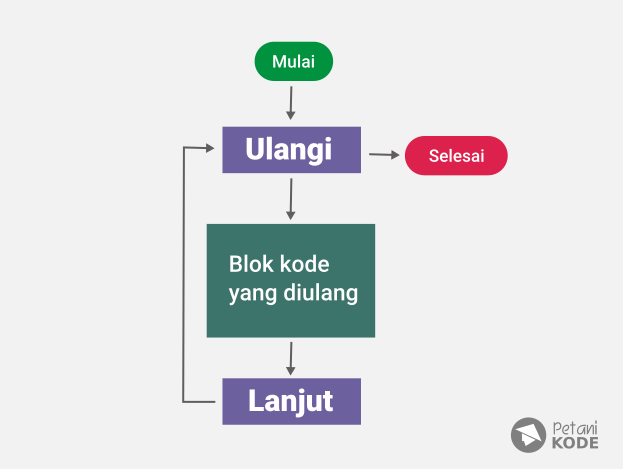
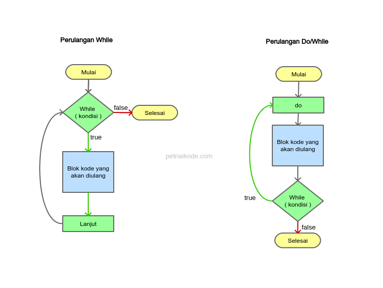
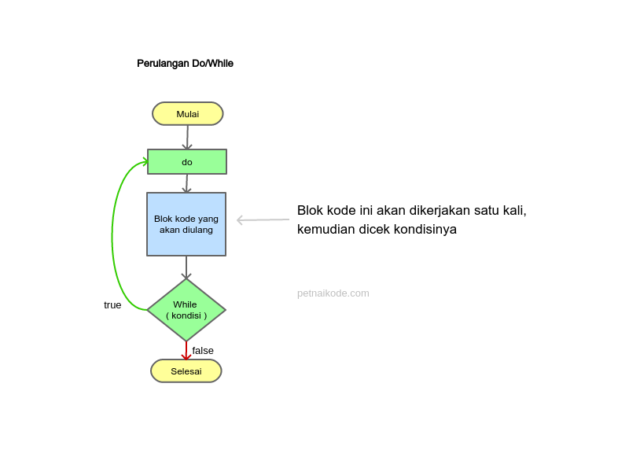
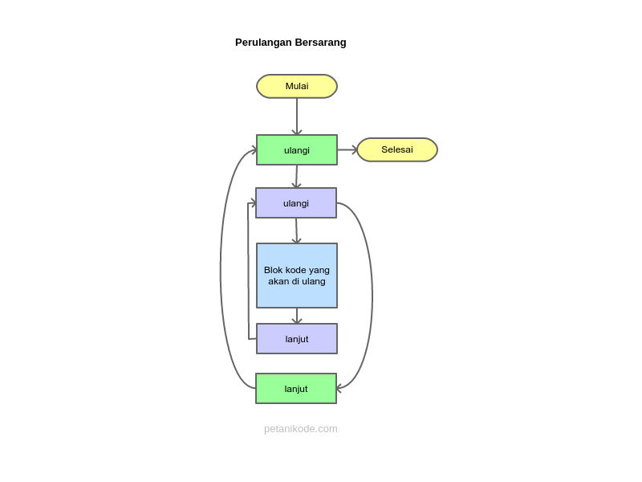

# Pengulangan (Loop)

Apa yang akan kita lakukan bila ingin menyuruh komputer mengerjakan perintah yang berulang-ulang?

Misalkan kita ingin menyuruh komputer menampilkan teks _Belajar Java_ sebanyak 5x.

Maka kita bisa menyuruhnya seperti ini:

```java
System.out.println("Belajar Java");
System.out.println("Belajar Java");
System.out.println("Belajar Java");
System.out.println("Belajar Java");
System.out.println("Belajar Java");
```
Tapi… bagaimana kalau sebanyak 1000x? Tentu adalah sesuatu yang sangat buruk jika kita harus menuliskan 1000 baris kode program yang sama. Untuk keperluan seperti ini kita bisa menggunakan perintah pengulangan.



Contoh perulangan:
```java
for (int hitungan = 0; hitungan <= 1000; hitungan++) {
    System.out.println("Belajar Java");
}
```
Sebelum masuk ke pembahasan lebih dalam, ada hal yang harus kalian ketahui terlebih dahulu.

Perulangan dalam pemrograman dibagi manjadi dua jenis:

1. **Counted loop**: Perulangan yang jumlah pengulangannya terhitung atau tentu. Perulangan ini terdiri dari perulangan _For_ dan _For each_
2. **Uncounted loop**: Perulangan yang jumlah pengulangannya tidak terhitung atau tidak tentu. Perulangan ini terdiri dari perulangan _While_ dan _Do/While_

## 1. Counted Loop
Seperti yang sudah dijelaskan, perulangan ini memiliki jumlah pengulangan yang tentu dan terhitung.

Perulangan ini terdiri dari perulangan _For_ dan _For each_.

Mari kita bahas satu per satu…

### Perulangan _For_
Format penulisan perulangan For di java adalah sebagai berikut:

```
for( int hitungan = 0; hitungan <= 10; hitungan++ ){
    // blok kode yang akan diulang
}
```
Penjelasan:
* variabel `hitungan` tugasnya untuk menyimpan hitungan pengulangan.
* `hitungan <= 10` artinya selama nilai hitungannya lebih kecil atau sama dengan 10, maka pengulangan akan terus dilakukan. Dengan kata lain, perualangan ini akan mengulang sebanyak 10 kali.
* `hitungan++` fungsinya untuk menambah satu (+1) nilai hitungan peda setiap pengulangan.
* Blok kode _For_ dimulai dengan tanda `{` dan diakhiri dengan `}`.
  
Mari kkita coba dalam contoh program…

**Contoh Program Perulangan _For_**
Silahkan buat class baru bernama Bintang, kemudian ikuti kode berikut:
```java
class Bintang{
    public static void main(String[] args){

        for(int i=0; i <= 5; i++){
            System.out.println("*****");
        }

    }
}
```
Hasil output:
```
*****
*****
*****
*****
*****
*****
```
Mau lagi?

Sekarang cobalah buat program untuk menampilkan nilai dari 1 sampai 10 dengan menggunakan perulangan.

```java
class CetakAngka{

    public static void main(String[] argumen){

        for(int i=0; i <= 10; i++){
            System.out.print( i + " " );
        }

    }

}
```
Hasil output:
```
0 1 2 3 4 5 6 7 8 9 10
```
Coba kita lakukan sedikit eksperimen.

Buat sebuah program yang menampilkan bilangan ganjil saja.
```java
class CetakBilanganGanjil{

    public static void main(String[] argumen){
        for(int i = 1; i <= 20; i += 2){
            System.out.print( i + " ");
        }
    }

}
```
Hasil output:
```
1 3 5 7 9 11 13 15 17 19
```
Perhatikan: di sana kita menggunakan `i += 2`, bukan `i++`.

Apa maksudnya?

Maksudnya, nilai `i` akan ditambah dua (+2) di setiap pengulangan.

**Perulangan _For Each_**
Perulangan ini sebenarnya digunakan untuk menampilkan isi dari array.

Apa itu array? Singkatnya, array itu variabel yang menyimpan lebih dari satu nilai dan memiliki indeks. Selengkapnya, nanti bisa di pelajari pada materi: [Mengenal Array di Java](10-array.md).

Pada bagian ini, kita akan sekilas mempelajari perulangan _For Each_ pada Java. Untuk melakukan, kita menggunakan kata kunci _For_. Perhatikan contohnya berikut:

```java
for ( int item : dataArray ) {
    // blok kode yang diulang
}
```
Penjelasan:
* variabel `item` akan menyimpan nilai dari array
* Kita bisa baca seperti ini: “Untuk setiap `item` dalam `dataArray`, maka lakukan perulangan”

**Contoh Program _For Each_**

Buat sebuah class baru bernama `PerulanganForeach`, kemudian ikuti kode berikut.
```java
public class PerulanganForeach {
    public static void main(String[] args) {

        // membuat array
        int angka[] = {3,1,42,24,12};

        // menggunakan perulangan For each untuk menampilkan angka
        for( int x : angka ){
            System.out.print(x + " ");
        }

    }
}

```
Hasil outputnya:
```
3 1 42 24 12
```

## 2. Uncounted Loop
Seperti yang sudah dijelaskan di awal tadi, perulangan ini tidak jelas jumlah pengulangannya.

Tapi, tidak menutup kemungkinan juga, jumlah pengulangannya dapat ditentukan.

Perulangan _uncounted loop_ terdirid dari perulangan _While_ dan _Do/While_.




Mari kita bahas satu per satu…

### Perulangan While
_While_ bisa kita artikan _selama_. Cara kerja perulangan ini seperti percabangan, ia akan melakukan perulangan _selama_ kondisinya bernilai `true`.

Struktur penulisan perulangan while:
```
while ( kondisi ) {
    // blok kode yang akan diulang
}
```

Penjelasan:
* kondisi bisa kita isi dengan perbandingan maupun variabel boolean. Kondisi ini hanya memiliki nilai `true` dan `flase`.
* Perulangan `while` akan berhenti sampai kondisi bernilai `false`.

Untuk lebih jelasnya, perhatikan program berikut. Program ini akan melakukan perulangan selama jawabannya bukan _ya_.
```java
import java.util.Scanner;

public class PerulanganWhile {
    public static void main(String[] args) {

        // membuat variabel dan scanner
        boolean running = true;
        int counter = 0;
        String jawab;
        Scanner scan = new Scanner(System.in);

        while( running ) {
            System.out.println("Apakah anda ingin keluar?");
            System.out.print("Jawab [ya/tidak]> ");

            jawab = scan.nextLine();

            // cek jawabnnya, kalau ya maka berhenti mengulang
            if( jawab.equalsIgnoreCase("ya") ){
                running = false;
            }

            counter++;
        }

        System.out.println("Anda sudah melakukan perulangan sebanyak " + counter + " kali");

    }
}
```
Hasil outputnya:
```
Apakah anda ingin keluar?
Jawab [ya/tidak]> tidak
Apakah anda ingin keluar?
Jawab [ya/tidak]> tidak
Apakah anda ingin keluar?
Jawab [ya/tidak]> tidak
Apakah anda ingin keluar?
Jawab [ya/tidak]> ya
Anda sudah melakukan perulangan sebanyak 4 kali
```

Program di atas akan melakukan pengulangan menanyakan _Apakah anda ingin keluar?_. Selama user menjawab selain jawaban _ya_, maka program akan terus memberikan pertanyaan. Setiap pengulangan, program juga menambahkan variabel `counter` +1 sehingga pada bagian akhir kita bisa mengetahui berapa kali program melakungan pengulangan.

Kalau nilai variabel `running` bernilai `false`, maka perulangan berhenti.

Contoh kode `while` di atas dapat kita baca seperti ini: "Lakukan perulangan selama nilai `running` bernilai `true`".

Tidak menutup kemungkinan juga, perulangan ini dapat melakukan _counted loop_.

Contohnya seperti ini:
```java
int i = 0;

while ( i <= 10 ){
    // blok kode yang akan diulang
    System.out.println('Perulangan ke-' + i);

    // increment nilai i
    i++;
}
```
Hasil outputnya:
```
Perulangan ke-0
Perulangan ke-1
Perulangan ke-2
Perulangan ke-3
Perulangan ke-4
Perulangan ke-5
Perulangan ke-6
Perulangan ke-7
Perulangan ke-8
Perulangan ke-9
Perulangan ke-10
```
Penting: pastikan melakukan increment (`i++`) terhadap variabel counter. Karena kalau tidak, perulangannya akan terus-menerus dilakukan sampai komputernya hang.


### Perulangan _Do/While_
Cara kerja perulangan _Do/While_ sebenarnya sama seperti perulangan While.

Bedanya, _Do/While_ melakukan satu kali perulangan dulu. Kemudian mengecek kondisinya.




Struktur penulisannya seperti ini:
```java
do {
    // blok kode yang akan diulang
} while (kondisi);
```
Jadi kerjakan dulu (`do`), baru di cek kondisinya `while( kondisi )`. Kalau kondisi bernilai `true`, maka lanjutkan perulangan.

**Contoh Program dengan Perulangan _Do/While_**
```java
public class PerulanganDoWhile {
    public static void main(String[] args) {

        // membuat variabel
        int i = 0;

        do {
            System.out.println("perulangan ke-" + i);
            i++;
        } while ( i <= 10);

    }
}
```

Hasil outputnya:
```
perulangan ke-0
perulangan ke-1
perulangan ke-2
perulangan ke-3
perulangan ke-4
perulangan ke-5
perulangan ke-6
perulangan ke-7
perulangan ke-8
perulangan ke-9
perulangan ke-10
```

## Perulangan Bersarang (Nested Loop)
Perulangan juga dapat bersarang. Perulangan bersarang maksudnya, perulangan dalam perulangan atau disebut juga nested loop.

Contoh bentuk flow chart-nya seperti ini:



**Contoh Program Perulangan Bersarang**
```java
public class PerulanganBersarang {
    public static void main(String[] args) {

        // membuat variabel
        int x, y;

        // melakukan perulangan sebanyak x dan y kali
        for (x = 0; x <= 5; x++){
            for( y = 0; y <= 3; y++){
                System.out.format("Perulangan [x=%d, y=%d] %n", x, y);
            }
        }
    }
}
```

Hasil output:
```
Perulangan [x=0, y=0]
Perulangan [x=0, y=1]
Perulangan [x=0, y=2]
Perulangan [x=0, y=3]
Perulangan [x=1, y=0]
Perulangan [x=1, y=1]
Perulangan [x=1, y=2]
Perulangan [x=1, y=3]
Perulangan [x=2, y=0]
Perulangan [x=2, y=1]
Perulangan [x=2, y=2]
Perulangan [x=2, y=3]
Perulangan [x=3, y=0]
Perulangan [x=3, y=1]
Perulangan [x=3, y=2]
Perulangan [x=3, y=3]
Perulangan [x=4, y=0]
Perulangan [x=4, y=1]
Perulangan [x=4, y=2]
Perulangan [x=4, y=3]
Perulangan [x=5, y=0]
Perulangan [x=5, y=1]
Perulangan [x=5, y=2]
Perulangan [x=5, y=3]
```
---

**Referensi:**
- https://www.petanikode.com/java-perulangan/