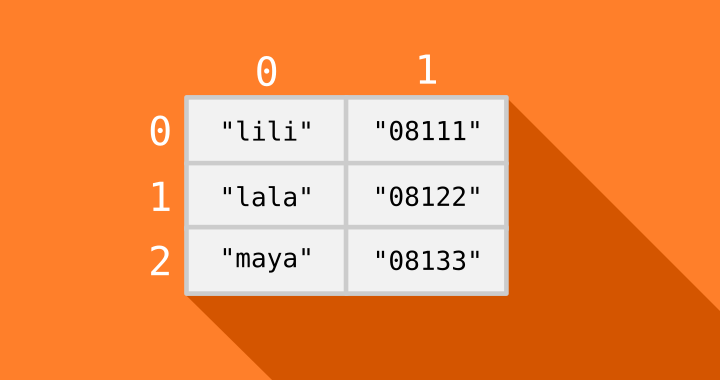
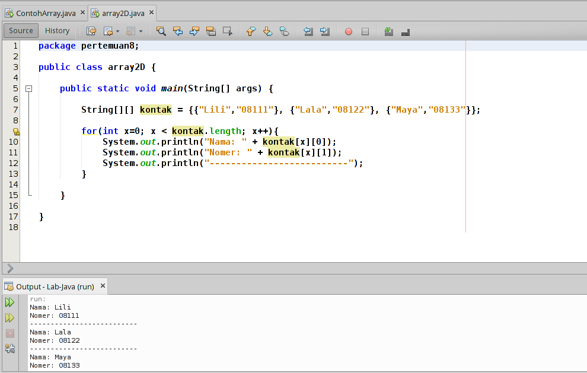
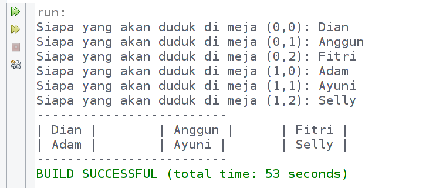

# Array

Misal kita memiliki beberapa nama. Tentu kita bisa menyimpannya masing-masing dalam variabel, tapi tentu ini akan sulit dalam pengolahannya terutama jika datanya banyak.

```
String namaTeman1 = "Linda";
String namaTeman2 = "Santi";
String namaTeman3 = "Susan";
String namaTeman4 = "Mila";
String namaTeman5 = "Ayu";
```

Hal ini bisa saja dilakukan, akan tetapi masalah akan muncul ketika kita harus berhadapan dengan data yang banyak. Untuk keperluan ini kita menggunakan Array. Array adalah struktur data yang bisa menyimpan banyak data dalam satu variabel. Array menggunakan indeks untuk memudahkan akses terhadap data yang disimpannya.


## Cara Membuat Array di Java
Cara membuat array kosong:
```java
// cara pertama
String[] nama;

// cara kedua
String nama[];

// cara ketiga dengan kata kunci new
String[] nama = new String[5];
```

**Perhatikan:**
* Gunakan kurung siku [] untuk membuat array;
* Kurung siku bisa diletakkan setelah tipe data atau nama array;
* Angka 5 dalam kurung artinya batas atau ukuran array-nya.

Array yang kosong siap diisi dengan data. Pastikan mengisinya dengan data yang sesuai dengan tipe datanya.

Kita bisa mengisinya seperti ini:
```java
nama[0] = "Linda";
nama[1] = "Santi";
nama[2] = "Susan";
nama[3] = "Mila";
nama[4] = "Ayu";
```

Atau, Anda juga bisa menggunakan cara berikut untuk melakukan inisialisasi sekaligus mengisi array.

```java
String[] nama = {"Linda", "Santi", "Susan", "Mila", "Ayu"};
```

## Membaca Data dari Array
Seperti yang sudah kita ketahui, array memiliki indeks untuk memudahkan kita mengakses datanya. Indeks array selalu dimulai dari `0`. Karena itu, kita bisa mengambil datanya dengan cara seperti ini:

```java
// membuat array
String[] nama = {"Linda", "Santi", "Susan", "Mila", "Ayu"};

// mengambil data array
System.out.println(teman[0]);
System.out.println(teman[2]);
```

Output:
```
Linda
Susan

```
Elemen pertama (`Linda`) ditampilkan dengan mengakses indeks ke-0 (urutan pertama), sedangkan `Susan` ditampilkan dengan mengakses indeks ke-2 (urutan ke-3).
Hati-hati untuk tidak mengakses data dengan indeks melebihi batas banyak data. Hal itu akan menyebabkan _runtime error_.


## Menggunakan Perulangan

Kita bisa mengakses data yang tersimpan dalam bentuk array dengan menggunakan _pengulangan_.

```java
String[] nama = {"Linda", "Santi", "Susan", "Mila", "Ayu"};

for(int n=0; n<=nama.length; n++) {
    System.out.println("Index ke-"+n+": "+nama[n]);
}

```

Output:
```
Index ke-0: Linda
Index ke-1: Santi
Index ke-2: Susan
Index ke-3: Mila
Index ke-4: Ayu
```

**Perhatikan:**
* atribut `length` pada `nama.length` digunakan untuk mengambil banyak elemen pada array `nama`. Dengan demikian, perulangan akan dilakukan sebanyak isi array-nya.

## Latihan

Silahkan buat class bernama `Buah`, kemudian ikuti kode berikut:
```java
import java.util.Scanner;

public class Buah {
    public static void main(String[] args) {

        // membuat array buah-buahan
        String[] buah = new String[5];

        // membuat scanner
        Scanner scan = new Scanner(System.in);

        // mengisi data ke array
        for( int i = 0; i < buah.length; i++ ){
            System.out.print("Buah ke-" + i + ": ");
            buah[i] = scan.nextLine();
        }

        System.out.println("---------------------------");

        // menampilkan semua isi array
        for( String b : buah ){
            System.out.println(b);
        }

    }
}
```
Hasil outputnya:

```
Buah ke-0: Apel
Buah ke-1: Anggur
Buah ke-2: Manggis
Buah ke-3: Jeruk
Buah ke-4: Semangka
---------------------------
Apel
Anggur
Manggis
Jeruk
Semangka
```

**Perhatikan:**
Di sana kita menggunakan perulangan `foreach` untuk menampilkan isi array. (lihat bab [Pengulangan (Loop)](08-pengulangan.md))


## Array Multi Dimensi
Array multi dimensi artinya array yang memiliki lebih dari satu dimensi.

Atau kita bisa sebut, array di dalam array.

Jumlah dimensinya tidak terbatas, tergantung kita mampunya sampai berapa 😄.

Contoh berikut ini adalah array dua dimensi:

```java
String[][] kontak = {
    {"Lili","08111"},
    {"Lala","08122"},
    {"Maya","08133"}
};
```
Indek ke-`0` pada array `kontak` berisi array `{"lili","08111"}`.



Contoh cara mengakses data dari array dua dimensi:



**Contoh Program Array Multi Dimensi**

Biar makin mantap pemahaman kita tentang array multi dimensi, mari kita coba membuat sebuah program.

Silahkan buat class baru bernama `RuangKelas` kemudian ikuti kode berikut:

```java
import java.util.Scanner;

public class RuangKelas {
    public static void main(String[] args) {

        // Membuat Array dan Scanner
        String[][] meja = new String[2][3];
        Scanner scan = new Scanner(System.in);

        // mengisi setiap meja
        for(int bar = 0; bar < meja.length; bar++){
            for(int kol = 0; kol < meja[bar].length; kol++){
                System.out.format("Siapa yang akan duduk di meja (%d,%d): ", bar, kol);
                meja[bar][kol] = scan.nextLine();
            }
        }

        // menampilkan isi Array
        System.out.println("-------------------------");
        for(int bar = 0; bar < meja.length; bar++){
            for(int kol = 0; kol < meja[bar].length; kol++){
                System.out.format("| %s | \t", meja[bar][kol]);
            }
            System.out.println("");
        }
        System.out.println("-------------------------");
    }
}
```
Hasil outputnya:



Pada program tersebut, kita menggunakan perulangan bersarang untuk mengambil input dan menampilkan outputnya. Karena array dua dimensi mirip seperti tabel, maka kita harus melakukan perulangan terhadap baris dan kolomnya.


## Array List
Array yang kita bahas di atas sebenarnya memiliki beberapa kekurangan, seperti:
* Tidak mampu menyimpan data dengan tipe yang berbeda.
* Ukurannya tidak dinamis.
* Maka dari itu, ada Array List yang menutupi kekurangan tersebut.

Array list merupakan sebuah class yang memungkinkan kita membuat sebuah objek untuk menampung apapun.

Untuk menggunakan Array List, kita harus mengimpornya terlebih dahulu.

```java
import java.util.ArrayList;
```
Setelah itu, baru kita bisa membuat sebuah objek `ArrayList` seperti ini:

```java
ArrayList al = new ArrayList();
```

**Contoh Program dengan Array List**

Silahkan membuat class dengan nama Doraemon, kemudian ikuti kode berikut:

```java
import java.util.ArrayList;

public class Doraemon {
    public static void main(String[] args) {

        // membuat objek array list
        ArrayList kantongAjaib = new ArrayList();

        // Mengisi kantong ajaib dengan 5 benda
        kantongAjaib.add("Senter Pembesar");
        kantongAjaib.add(532);
        kantongAjaib.add("tikus");
        kantongAjaib.add(1231234.132);
        kantongAjaib.add(true);

        // menghapus tikus dari kantong ajaib
        kantongAjaib.remove("tikus");

        // Menampilkan isi kantong ajaib
        System.out.println(kantongAjaib);

        // menampilkan banyak isi kantong ajaib
        System.out.println("Kantong ajaib berisi "+ kantongAjaib.size() +" item");
    }
}
```
Hasil outputnya:

```
[Senter Pembesar, 532, 1231234.132, true]
Kantong ajaib berisi 4 item
```

Karena array list (`kantongAjaib`) merupakan sebuah objek yang terbuat dari class `ArrayList`, maka dia punya _method_ (fungsi) untuk melakukan sesuatu.
* Fungsi `add()` untuk menambahkan sesuatu ke dalam Array List;
* Fungsi `remove()` untuk menghapus sesuatu ke dalam Array List;
* Fungsi `size()` untuk mengambil ukuran Array List;
* Fungsi `get(index)` untuk mengambil item dalam Array List berdasarkan id atau indeks tertentu. Jadi pada array membaca elemen dilakukan dengan cara `nama[n]`, pada `ArrayList` dilakukan dengan `nama.get(index)`.
* dan masih banyak fungsi yang lainnya. Daftar lengkapnya Anda bisa cek di [dokumentasi resmi Java Class ArrayList](https://docs.oracle.com/javase/8/docs/api/java/util/ArrayList.html).

---
**Referensi:**
* https://www.petanikode.com/java-array/
* https://www.w3schools.com/java/java_arraylist.asp