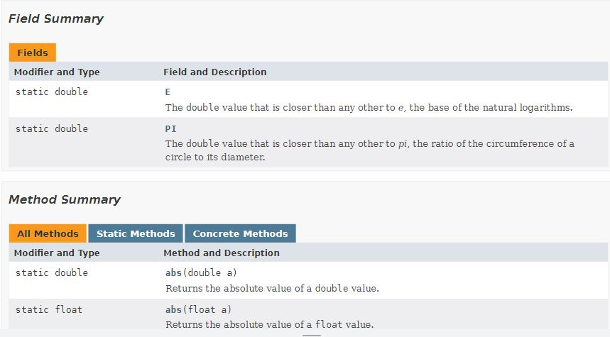

# Java Standard Class

Java memiliki berbagai fungsi untuk melakukan banyak hal. Fungsi-fungsi ini dibungkus dalam class, dan class ini disimpan dalam bentuk _package_. Beberapa _package_ bisa langsung digunakan, beberapa memerlukan perintah `import` untuk class ini bisa digunakan. Daftar lengkap dari _package_ yang bisa digunakan Anda bisa check di [Java Platform SE 8 - All Classes](https://docs.oracle.com/javase/8/docs/api/allclasses-frame.html). Dalam bab ini, ita akan coba mempelajari beberapa _package_ standard yang umum dipakai.

## Membaca Dokumentasi dan Menggunakan Fungsi, Contoh: _Math_
Membaca dokumentasi adalah hal penting yang perlu dibiasakan bagi seseorang yang belajar pemrograman. Dokumentasi yang baik memiliki standar penulisan yang konsisten, sehingga memudahkan kita untuk mempelajarinya. Tapi, meskipun demikian perlu latihan dan pembiasaan diri untuk kita bisa membaca dokumentasi secara efektif. Mari kita check dokumentasi _package Math_, dari sumber resmi developer Java, [Java Platform SE 8 - Math](https://docs.oracle.com/javase/8/docs/api/java/lang/Math.html). 

**Contoh tampilan dokumentasi Java:**



Pada halaman ini kita bisa menemukan banyak penjelasan, tapi pada bagian ini kita akan fokuskan pada 2 bagian: 1. _Field Summary_; 2. _Method Summary_

Pada _Field Summary_ Anda bisa menemukan bahwa _package Math_ menyediakan konstanta _pi_ (π) dan konstanta _e_ (basis bilangan natural).

Pada _Method Summary_ Anda bisa menemukan daftar fungsi yang bisa digunakan. Ketika kita mempelajari bagaimana menggunakan fungsi, Anda bisa mulai dari hal-hal berikut:
1. **Nama fungsi:** perhatikan penulisan nama fungsinya
2. **Parameter yang perlu digunakan:** Perhatikan bagian _Method and description_. Contoh, fungsi `abs` memerlukan 1 parameter. Perhatikan juga fungsi `abs` bisa dipanggil dengan 4 cara, tergantung dari tipe data dari parameter yang diberikan. Ia bisa dipanggil dengan menggunakan parameter `double a`, `float a`, `int a`, `long a`.
3. **Nilai kembali/_return value_:** Perhatikkan bagian _Modified and Type_. Bagian ini menunjukan jenis data hasil dari pengolahan fungsi. Contoh, jika kita menggunakan fungsi `asin(double a)`, maka output fungsi akan berupa data bertipe `double`.

Berikut contoh penggunaan fungsi pada _Math_

```java

public class Test {
    public static void main(String[] args) {
        int a = 3;
        int b = 4;
        int c = -5;
        double d = -1.75;

        System.out.println("Akar dari "+b+" adalah "+Math.sqrt(b));
        System.out.println("Akar dari "+a+" adalah "+Math.sqrt(a));
        System.out.println("Nilai absolut "+c+" adalah "+Math.abs(c));
        System.out.println("Nilai absolut "+d+" adalah "+Math.abs(d));
        System.out.println("Nilai PI: "+Math.PI);
    }
}

```
**Penjelasan:**
* Perhatikan pemanggilan konstanta _pi_ menggunakan `Math.PI`, tanpa menggunakan `()`.

Di internet Anda akan menemukan banyak website yang menyediakan tutorial dan referensi perintah Java. Tentu tidak semuanya memiliki format penulisan yang sama persis seperti yang kita lihat di situs resmi developer Java dan  tidak semua dari website yang Anda temui memberikan cara penulisan yang baik. Website yang baik ditandai dengan cara penulisan yang terstruktur dan konsisten.

Beberapa website berikut Anda bisa pakai untuk menjadi referensi untuk mempelajari tutorial dan referensi perintah Java:
* [w3schools - Java](https://www.w3schools.com/java/)
* [Programiz - Java](https://www.programiz.com/java-programming)
* [GeeksForGeeks - Java](https://www.geeksforgeeks.org/java/)
* [javaTpoint](https://www.javatpoint.com/java-tutorial)


**Latihan:**
* [Soal Latihan (Math)](https://github.com/pujangga123/ruang-belajar-java/blob/main/docs/latihan/06-class-3.md). 
* [Soal Latihan (String)](https://github.com/pujangga123/ruang-belajar-java/blob/main/docs/latihan/06-class-2.md). 

## Import Package dan Membuat Objek, Contoh: _Random_
Java menyediakan banyak _package_ yang bisa digunakan.  _Package Math_ adalah salah satu _package_ yang secara default di load dalam setiap eksekusi program. Tapi, tidak semua _package_ di load ke memory untuk setiap program yang kita buat.Untuk efisiensi, _package_ yang di-load ke memory hanyalah _package_ yang akan digunakan. Oleh sebab itu, sebagian besar _package_ perlu _dipanggil_ terlebih dahulu menggunakan perintah `import`.

Tentu Anda sudah mengenal penggunaan `import` ini ketika Anda menggunakan class `Scanner`. Memang _package Scanner_ juga adalah salah satu _package_ yang perlu di-import sebelum digunakan. Tapi pada kesempatan kali ini, kita akan menggunakan contoh _package Random_. _Package Random_ berisi berbagai fungsi untuk menghasilkan bilangan acak. Check dokumentasi package ini di [Java Platform SE 8 - Random](https://docs.oracle.com/javase/8/docs/api/java/util/Random.html)

Contoh 1:
```java
import java.util.Random;
import java.util.Scanner;

public class Test {
    public static void main(String[] args) {
        Random rnd = new Random();
        Scanner scan = new Scanner(System.in);
        int max;

        System.out.print("Nilai Max: ");
        max = scan.nextInt();

        System.out.println("Bilangan acak antara 0-"+max+" --> "+rnd.nextInt(max));
    }
}
```

**Penjelasan**
* Sama seperti penggunaan **Scanner**, beberapa fungsi dalam _package_ _dibungkus_ dalam bentuk class. Sehingga, untuk bisa menggunakannya kita perlu membuat objeknya terlebih dahulu. Dalam contoh di atas: `Random rnd = new Random()`.
* `rnd` adalah objek yang dibuat dari class `Random`. `scan` adalah objek yang dibuat dari class `Scanner`.
* Beberapa class memiliki _constructor_. _Constructor_ ini adalah fungsi yang dijalankan pada saat objek dibuat. Definisi mengenai _contructor_ ini Anda bisa lihat pada bagian dokumentasi.
* Beberapa class memiliki _constructor_ dengan parameter. Anda bila melihat contohnya pada perintah `Scanner scan = new Scanner(System.in)`. Class _Scanner_ memiliki _constructor_ yang minta 1 parameter. Anda bisa check definisinya di [Java Platform SE 8 - Scanner](https://docs.oracle.com/javase/8/docs/api/java/util/Scanner.html)
* `rnd.nextInt(max)` adalah fungsi untuk menghasilkan bilangan acak _integer_ dari `0` sampai `max-1`. Pada saat program dijalankan, ketika user input `6` pada pertanyaan _Nilai Max_, maka `rnd.nextInt(max)` akan menghasilkan bilagan acak antara `0` sampai `5`.


**Latihan:**
* [Soal Latihan (Random)](https://github.com/pujangga123/ruang-belajar-java/blob/main/latihan/06-class-1.md). 

## Objek Sebagai Struktur Data Kompleks, Contoh: _LocalDate_
Java merupakan bahasa pemrograman yang sangat kental dengan penerapan paradigram Object Oriented Programming (OOP). Mustahil menguasai Java tanpa kita mempelajari konsep OOP. Lebih banyak tentang OOP, kita akan pelajari pada bagian khusus (check [Ruang Belajar OOP](https://pujangga123.github.io/ruang-belajar-oop/)). Untuk kesederhanaan pembahasan bagian ini, sementara kita akan melihat objek sebagai _struktur data kompleks/non-tradisional_.

Struktur data tradisional adalah struktur data mendasar yang menyimpan nilai _sedernaha_, seperti: _int_, _float_, _double_, _char_, _boolean_. Struktur data kopleks adalah struktur data yang biasanya terdiri dari beberapa elemen. Contohnya: _LocalDate_ (tanggal). Satu data yang berupa _LocalDate_, akan memiliki elemen _tanggal_, _bulan_, _tahun_. Terkait dengan objek _LocalDate_, kita terdapat juga menggunakan bisa fungsi untuk mengolah tanggal. Untuk dokumentasi, check [Java Platform SE 8 - LocalDate](https://docs.oracle.com/javase/8/docs/api/java/time/LocalDate.html)

Perhatikan contoh program berikut.

```java
import java.time.LocalDate;    

public class LocalDateExample2 {    
    public static void main(String[] args) {    
        LocalDate sekarang = LocalDate.now();
        LocalDate tanggal = LocalDate.of(2000, 10, 13);    
               
        System.out.println("Tanggal sekarang "+sekarang);    
        System.out.println("Bulan: "+sekarang.getMonth());
        System.out.println("Bulan: "+sekarang.getMonthValue());
        System.out.println("Tahun Kabisat: "+sekarang.isLeapYear());

        System.out.println();
        LocalDate kemarin = sekarang.plusDays(-1);
        System.out.println("Kemarin: "+kemarin);
        System.out.println("Hari Kemarin: "+kemarin.getDayOfWeek());

        System.out.println();
        LocalDate lahir = LocalDate.of(2016, 9, 23);    
        System.out.println("Tanggal Lahir "+lahir);    
        System.out.println("Hari Lahir: "+lahir.getDayOfWeek());

    }    
}    
```

Struktur data komplek lain yang cukup umum digunakan dan Anda bisa pelajari untuk belajar: [_LocalTime_](https://docs.oracle.com/javase/8/docs/api/java/time/LocalTime.html), [_ArrayList_](https://docs.oracle.com/javase/8/docs/api/java/util/ArrayList.html), [_String_](https://docs.oracle.com/javase/8/docs/api/java/lang/String.html), [_Duration_](https://docs.oracle.com/javase/8/docs/api/java/time/Duration.html), [_Queue_](https://docs.oracle.com/javase/8/docs/api/java/util/Queue.html), [_Stack_](https://docs.oracle.com/javase/8/docs/api/java/util/Stack.html).