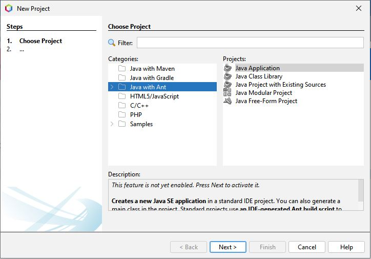
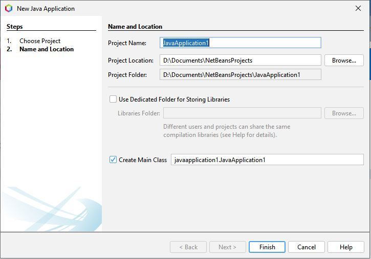
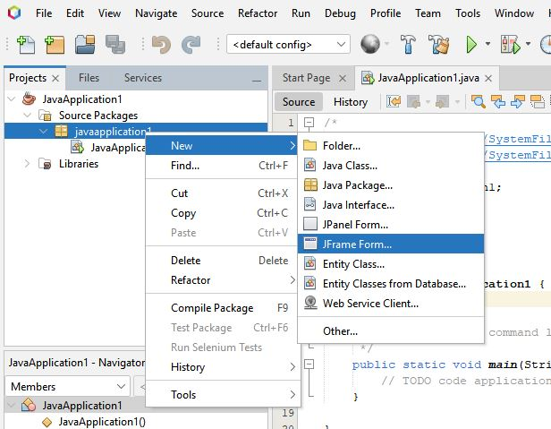
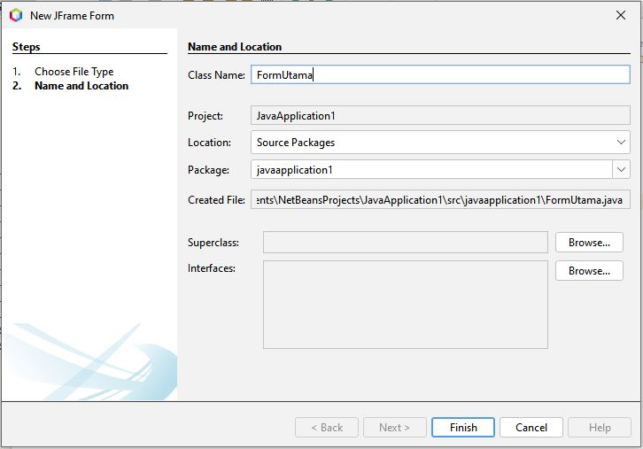
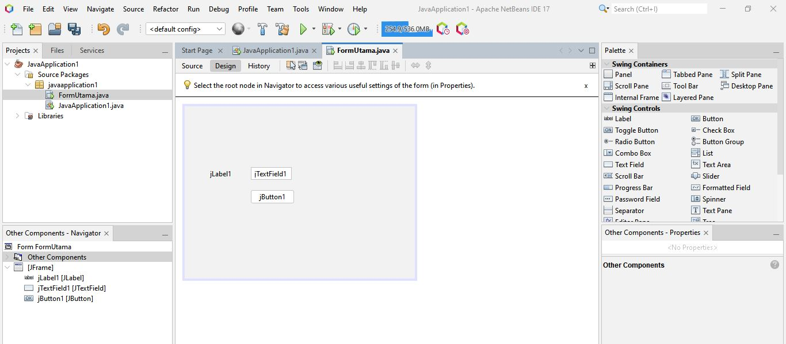
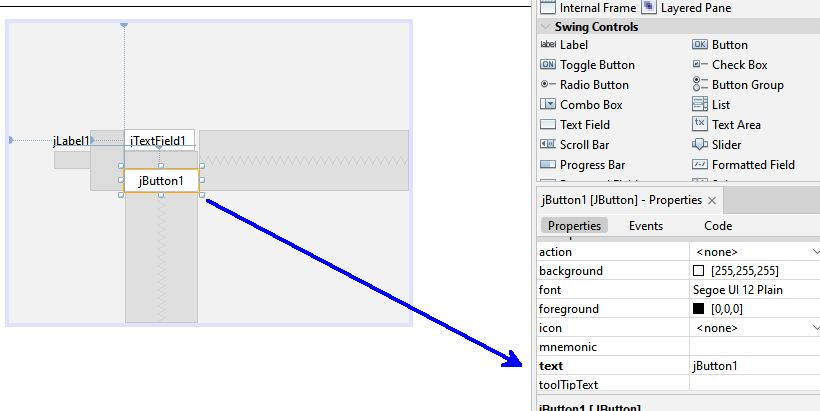
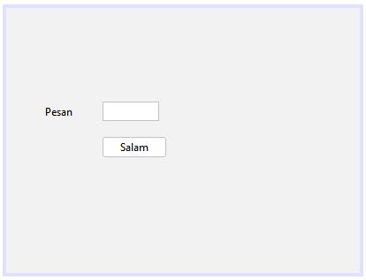
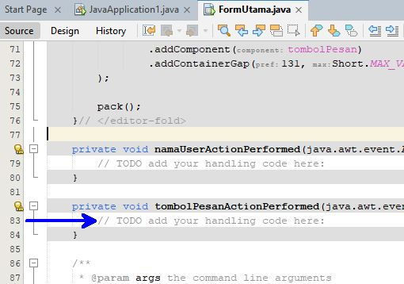
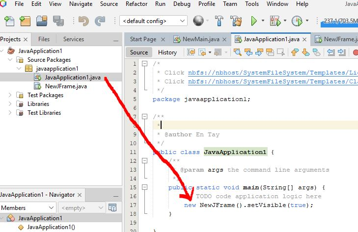
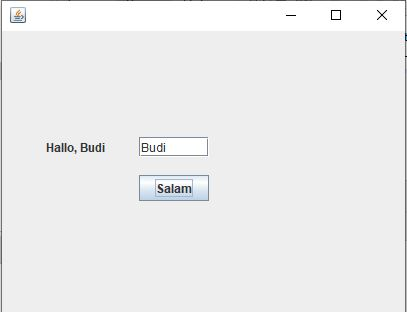

# Membuat GUI dengan Java
Pada bagian ini kita akan berkenalan dengan membuat GUI menggunakan Java. IDE yang akan digunakan dalam pembelajaran kita adalah Netbeans. Dalam modul ini, yang dipakai adalah Netbeans versi 13. Anda bisa download Netbeans di situs resminya.

## Membuat Project Baru
1. Klik menu: _File - New Project..._. Pilih _Categories: Java with Ant_ dan _Projects: Java Application_, kemudian klik _Next_.
   
   

   _Catatan:_ Jika ini adalah pertama kalinya Anda membuat project di Netbeans, biasanya setelah _next_ ada proses _Activating IDE_ yang memakan waktu beberapa menit. Silahkan tunggu sampai proses selesai.
2. Berikutnya Anda bisa menentukan _Project Name_ dan _Project Location_.
   
   
      
   Aturan penulisan _Project Name_ sesuai dengan aturan penamaan variabel, yaitu _tidak mengandung spasi, tidak diawali angka, tidak menggunakan karakter spesial_.
   Klik _Finish_ untuk menyimpan project yang baru ini.

## Basic Interface

## Membuat JFrame/Form
Mari kita membuat form (dalam Java disebut JFrame) pertama kita. Caranya, _klik kanan_ pada nama _package_ (dalam _Source Packages_), pilih _New - JFrame Form..._.



Pada window _New JFrame Form_ Anda bisa menentukan nama form. Untuk contoh ini, kita akan memberi nama `FormUtama`.

### Menambahkan Komponen/Objek/Class
Pada panel sebelah kanan, Anda bisa menemukan _Swing Containers_ dan _Swing Controls_. Ini adalah komponen/class yang bisa Anda tambahkan kepada form Anda. Cara menambahkan komponen ke dalam form dilakukan dengan drag and drop ke form Anda. Tambahkah 3 komponen: jLabel, jTextField, dan jButton, sehingga menjadi contoh di bawah ini.



Hal penting lain yang perlu dilakukan setelah menambahkan komponen adalah memberi nama variabel kepada komponen. Lakukan ini kepada komponen yang akan berinteraksi dengan kode program kita. Pada contoh diatas, komponen: _jTextField1_ dan _jButton_. Memberi nama variabel dilakukan dengan _klik kanan_ pada komponen kemudian _Change Variable Name..._.



Lakukan _Change Variable Name..._ pada masing-masing objek pada form:
* `jLabel1` ➡ `pesan`
* `jTextField1` ➡ `namaUser`
* `jButton1` ➡ `tombolPesan`

Walaupun nama variabel sudah berubah, tapi tulisan pada tampilan form belum berubah. Kita akan merubah tulisan tersebut pada bagian selanjutnya.

### Merubah Properti/Atribut
Setiap komponen/objek yang kita buat memiliki atribut/properti. Ini kita bisa lihat pada panel _Properties_ di sebelah kanan. Atribut ini bisa menentukan rupa-rupa sifat dari objek, misalnya: jenis tulisan, ukuran objek, warna tulisan, warna background, posisi, dll. Untuk merubah atribut, yang perlu kita lakukan adalah klik pada objek, kemudian cari properties yang kita mau rubah.

Contoh pada form diatas, klik pada tombol dan di panel _Properties_ akan menampilkan semua atributnya. Cari atribut `text` kemudian rubah jadi "Salam".



Lakukan perubahan berikut:
* `pesan.text` (_jLabel1_) ➡ `Pesan`
* `namaUser.text` (_jTextField1_) ➡ _kosong_
* `tombolPesan.text` (_jButton1_) ➡ `Salam`

Jika Anda melakukannya dengan benar maka form akan berubah menjadi seperti berikut:



### Menambahkan Kode Program
Misalnya pada contoh form di atas, kita mau mau membuat program, dimana ketika program dijalankan, maka user bisa input nama pada _TextField_ (misalnya: _Budi_), kemudian ketika user klik tombol "Salam" maka label akan memunculkan tulisan "Halo, Budi". Untuk ini kita perlu menambahkan kode program pada `tombolPesan`, caranya _double klik `tombolPesan`_. _Source editor_ akan muncul.



tambahkan kode program berikut pada fungsi `tombolPesanActionPerformed`
```java
        pesan.setText("Hallo, "+namaUser.getText());
```

Berikutnya, tambahkan program untuk menampilkan form, pada program utama.




### Menjalankan Program
Untuk penjalankan program yang kita buat di atas, klik tombol "play" pada toolbar atau tekan _F6_



_Catatan:_
* Jika Anda mendapati _TextField/Button/Label_ terpotong, coba edit form, rubah ukuran komponen _TextField/Button/Label_ tersebut, kemudian coba jalankan kembali programnya.

## Latihan


