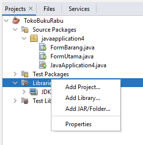

# Java - Koneksi ke Database
Dalam kuliah ini, kita akan menggunakan database MySQL sebagai DBMS yang untuk program Java kita.

## Setup _J Connector_
1. [download langsung paket _.jar_](https://github.com/pujangga123/ruang-belajar-java/raw/main/src/mysql-connector-j-8.0.33.jar)

2. Pada _project_ aktif Anda. Klik-kanan pada _Libraries - Add JAR/Folder..._. Pilih file _mysql-connector-j-xxx.jar_ yang Anda download sebelumnya.
   
   

## Test Koneksi
1. Aktifkan MySQL Server secara lokal (misal lewat XAMPP)
2. [Download & Restore database contoh](https://raw.githubusercontent.com/pujangga123/ruang-belajar-java/main/src/tokobuku.sql) ke server _MySQL_ Anda.
3. Test koneksi menggunakan contoh program berikut:
    ```java
    import java.sql.*;
    
    public class MySqlTest {
        public static void main(String arg[]) {
            Connection connection = null;
            try {
                // buat koneksi ke server mysql.
                Class.forName("com.mysql.cj.jdbc.Driver");
                connection = DriverManager.getConnection(
                    "jdbc:mysql://localhost:3306/tokobuku", "root", "");
    
                // siapkan objek statement untuk query
                Statement statement;
                statement = connection.createStatement();
                ResultSet resultSet;

                // eksekusi query
                resultSet = statement.executeQuery("select * from barang");

                // baca dan tampilkan data dari query
                String kode;
                String nama;
                while (resultSet.next()) { // baca data & geser kursor ke record selanjutnya
                    kode = resultSet.getString("kode"); // baca kolom "kode"
                    nama = resultSet.getString("nama"); // baca kolom "nama"
                    System.out.println("kode : " + kode + " nama : " + nama); // tampilkan data
                }

                // hapus objek dan koneksi
                resultSet.close();
                statement.close();
                connection.close();
            }
            catch (Exception exception) {
                // tampilkan pesan error (jika terjadi kesalahan)
                System.out.println(exception);
            }
        } // function ends
    } // class ends
    ```

