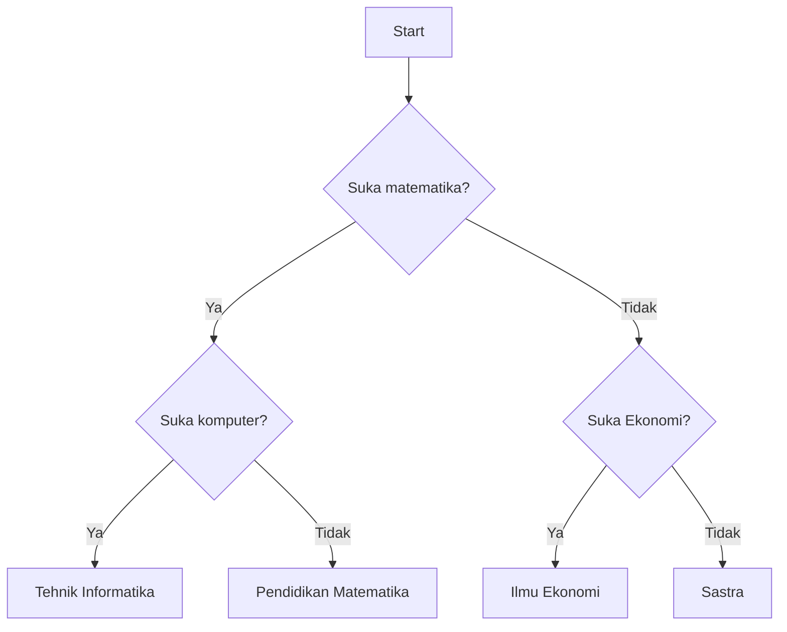

## Latihan Program 1

Buat program menggunakan Java yang mensimulasikan _memilih jurusan_. Proses pemilihan makanan mengikuti diagram seperti berikut:



contoh hasil 1:
```
Suka matematika?y
Suka komputer?y
Jurusan = Tehnik Informatika
```

contoh hasil 2:
```
Suka matematika?t
Suka Ekonomi?y
Jurusan = Ilmu Ekonomi
```