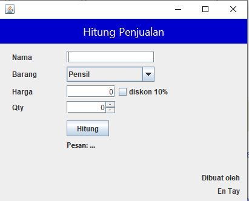

# Latihan (GUI)

## Soal 1

Buat form seperti pada contoh berikut:

## Soal 2

Lengkapi form pada *Soal 1* dengan beberapa detail berikut
* _ComboBox_ barang diisi dengan list barang: _Pensil, Penggaris, Buku_.
* Ketika user memilih barang di _ComboxBox_ barang, isi harga dengan ketentuan berikut:
  * _Pensil_ : 2000
  * _Penggaris_ : 4000
  * _Buku_ : 25000
* Lengkapi informasi pembuat pada bagian bawah form.
